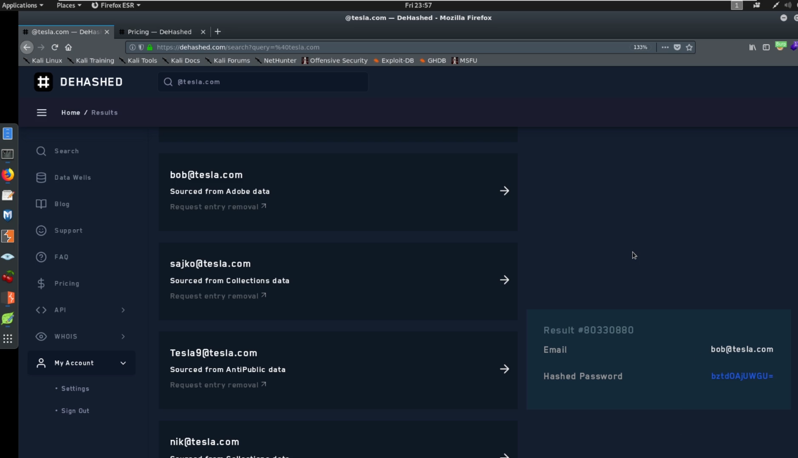
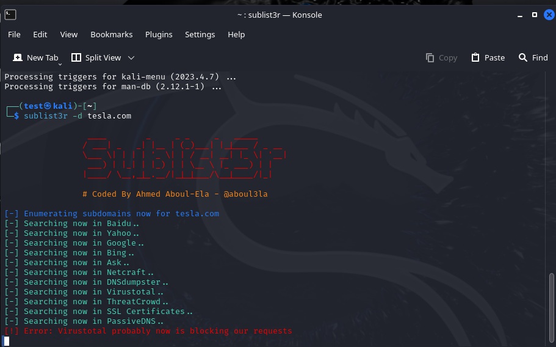
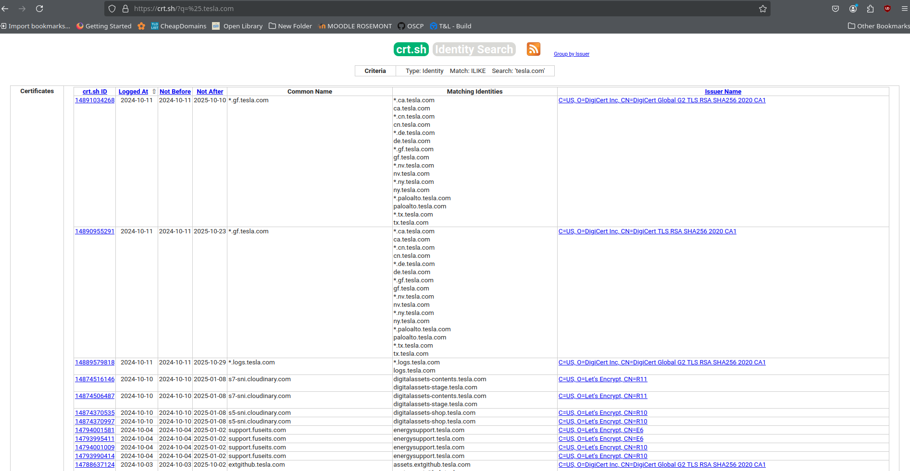
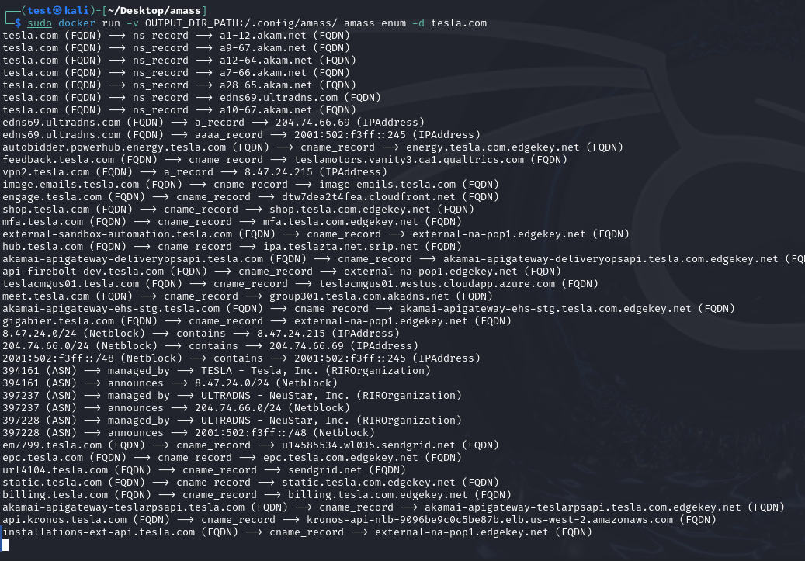
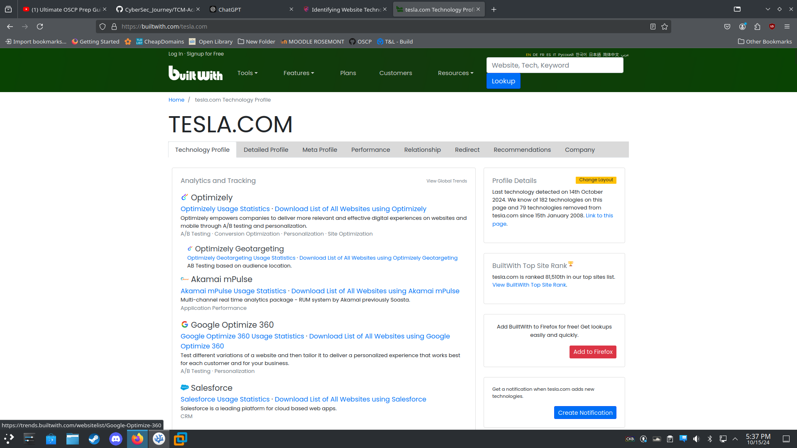
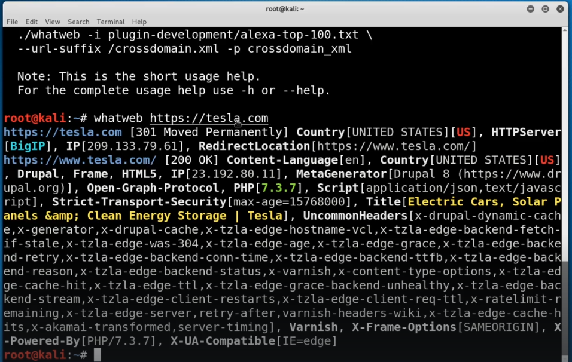
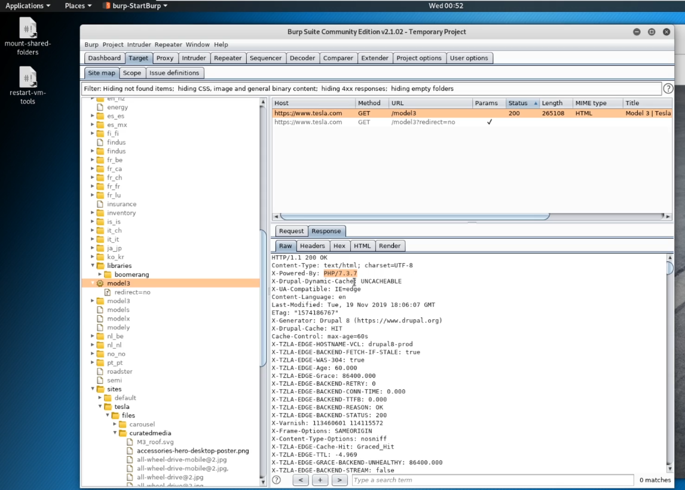

# Reconnaissance

Here’s a structured menu for your document based on the H2 headings:

# Reconnaissance

---

## Table of Contents
1. [Passive Reconnaissance Overview](#passive-reconnaissance-overview)
   - [Web/Host](#webhost)
     - [Target Validation](#target-validation)
     - [Finding Subdomains](#finding-subdomains)
     - [Fingerprinting](#fingerprinting)
     - [Data Breaches](#data-breaches)
2. [Discovering Email Addresses](#discovering-email-addresses)
   - [Finding Emails by Company](#finding-emails-by-company)
   - [Verifying Email Addresses](#verifying-email-addresses)
   - [Using Recovery Methods](#using-recovery-methods)
3. [Hunting Breached Credentials with DeHashed](#hunting-breached-credentials-with-dehashed)
4. [Hunting for Subdomains](#hunting-for-subdomains)
   - [Using Sublist3r](#using-sublist3r)
   - [Using crt.sh](#using-crtsh)
   - [Key Difference](#key-difference)
   - [Using OWASP Amass](#using-owasp-amass)
   - [Checking if Domains are Alive](#checking-if-domains-are-alive)
5. [Identifying Website Technologies](#identifying-website-technologies)
   - [Using BuiltWith](#using-builtwith)
   - [Using Wappalyzer](#using-wappalyzer)
   - [Using WhatWeb in the Terminal](#using-whatweb-in-the-terminal)
6. [Information Gathering with Burp Suite](#information-gathering-with-burp-suite)
   - [Intercepting Traffic](#intercepting-traffic)
7. [Google Fu](#google-fu)

---

> "The more I read, the more I acquire, the more certain I am that I know nothing." — Voltaire, 1778

---

## Passive Reconnaissance Overview
Passive reconnaissance involves gathering information about the target without directly interacting with it, using publicly available data.

### Web/Host

#### Target Validation
These tools are used to validate the identity and details of a target:

- **WHOIS**: Provides domain registration information.
- **nslookup**: Queries DNS to obtain domain name or IP address mapping.
- **dnsrecon**: Performs DNS enumeration and information gathering.

#### Finding Subdomains
These techniques and tools help in identifying subdomains of a target:

- **Google Fu**: Advanced Google search operators to find subdomains.
- **dig**: A command-line tool for querying DNS servers.
- **Nmap**: Can scan for active subdomains.
- **Sublist3r**: Python tool to enumerate subdomains across multiple sources.
- **Bluto**: A tool for finding subdomains and performing OSINT.
- **crt.sh**: Public database for certificate transparency logs.
- **etc...**

#### Fingerprinting
These tools are used to gather information about the technologies and services used by the target:

- **Nmap**: Network scanning tool that can identify operating systems and services.
- **Wappalyzer**: Browser extension that identifies technologies used on websites.
- **Whatweb**: Recognizes and identifies web technologies.
- **BuiltWith**: Web-based service to identify a website’s tech stack.
- **Netcat**: Networking tool for reading from and writing to network connections.

#### Data Breaches
These platforms help check if the target has been involved in any data breaches:

- **HaveIBeenPwnd**: Checks if emails or credentials have been exposed in a breach.
- **Breach-Parse**: A tool for parsing breach data.
- **WeLeakInfo**: Database of leaked information from various breaches.

## Discovering Email Addresses

One of the key steps in reconnaissance is discovering email addresses associated with a target.

### Finding Emails by Company

1. **[Hunter.io](https://hunter.io)**: Hunter.io is a popular tool used to find email addresses by company name.


2. **[Phonebook.cz](https://phonebook.cz)**: Another tool to search for email addresses across various domains and companies.


### Verifying Email Addresses

Once email addresses are gathered, they can be verified for validity using online tools:

3. **[Email Hippo](https://tools.emailhippo.com/)**: A service to verify whether an email address is valid and deliverable.


4. **[Email Checker](https://email-checker.net/)**: Another tool to check the validity of email addresses.


### Using Recovery Methods

Do not underestimate recovery methods (such as account recovery options) to gather additional information related to email addresses.


## Huntig Breached Credentials with DeHashed



## Hunting for Subdomains

To discover subdomains, we can use various tools and services. Below are two effective methods: using **Sublist3r** and **crt.sh**.

### 1. Using Sublist3r

**Sublist3r** is a popular tool for enumerating subdomains. It helps security researchers and penetration testers find valid subdomains for a given domain through OSINT.

#### Installation on Debian

To install Sublist3r on a Debian-based machine, simply run the following command:

```bash
sudo apt install sublist3r
```

#### Usage

Once installed, you can use Sublist3r by specifying the target domain. For example, to enumerate subdomains of `tesla.com`, execute the command:

```bash
sublist3r -d tesla.com
```

This will output a list of subdomains associated with the target domain, helping you identify potential entry points.



### 2. Using crt.sh

Another method to find subdomains is by leveraging **crt.sh**, a web-based tool that queries certificate transparency logs. It provides information on domains that have SSL/TLS certificates issued, which often include subdomains.

#### How to Use crt.sh

1. Visit the website: [crt.sh](https://crt.sh)
2. Enter the domain name you are investigating (e.g., `tesla.com`).
3. The results will display all certificates associated with the domain, including wildcard certificates like `*.tesla.com`.

This approach reveals subdomains based on publicly available certificates, giving you insight into secured subdomains that are not easily discoverable via DNS records.



### Key Difference

- **Sublist3r** scans multiple sources (such as DNS records and search engines) to discover subdomains. 

- **crt.sh** specifically looks for subdomains based on SSL certificates, giving you additional visibility into domains that have certificates issued but may not be indexed by search engines.

Both methods complement each other and provide a thorough approach to subdomain enumeration.

### 3. Using OWASP Amass

**OWASP Amass** is another powerful tool for subdomain enumeration. It uses advanced techniques to gather information from a wide range of sources, including DNS, public databases, and web archives, providing a more thorough subdomain discovery process.

#### Running Amass with Docker

The easiest way to get Amass running is through Docker. Here’s how you can use it to hunt for subdomains of `tesla.com`:

```bash
docker build -t amass https://github.com/owasp-amass/amass.git
docker run -v OUTPUT_DIR_PATH:/.config/amass/ amass enum --list
docker run -v OUTPUT_DIR_PATH:/.config/amass/ amass enum -d tesla.com
```

This command will launch Amass and begin collecting subdomain data, saving the output to the specified directory.

As shown in the image below, Amass gathers a vast amount of information, revealing subdomains, DNS records, and related metadata that can help identify potential attack vectors.



### Checking if Domains are Alive

Once you've enumerated subdomains, it's essential to verify which ones are actively responding. For this, we can use **HttpProbe**, a simple yet effective tool that checks if a domain or subdomain is alive by probing for active HTTP/HTTPS services.

#### Installation

To install **HttpProbe**, you need to have Go installed on your system. Then, run the following command:

```bash
go install github.com/tomnomnom/httprobe@latest
```

#### Usage

All you need is a file containing a list of domains or subdomains. You can pipe this list into **HttpProbe** to check which ones are alive. For example:

```bash
cat subdomains.txt | httprobe
```

This will check each domain in `subdomains.txt` and return only the ones that are responding to HTTP/HTTPS requests, allowing you to focus on live targets.

## Identifying Website Technologies

For this we can use https://builtwith.com/



Another way is to use wappalyzer


One way to do it with the terminal is ```whatweb```



## Identifying Website Technologies

Understanding the technologies used by a website can provide valuable insights for security assessments and penetration testing. Here are a few tools and methods to identify website technologies:

### 1. Using BuiltWith

**BuiltWith** is a web-based service that analyzes websites and identifies the various technologies used, including server software, analytics tools, and frameworks. You can access it at [builtwith.com](https://builtwith.com/).


### 2. Using Wappalyzer

**Wappalyzer** is another powerful tool that detects web technologies. It provides a browser extension as well as a web interface to analyze sites for the technologies they use.


### 3. Using WhatWeb in the Terminal

For those who prefer command-line tools, **WhatWeb** is an excellent option. It is a flexible and powerful tool that identifies various technologies used on websites.

To use WhatWeb, simply run the following command:

```bash
whatweb <target-website>
```

This will output a list of technologies detected on the specified website, allowing for quick reconnaissance.


Here’s an improved version of your section on information gathering with Burp Suite:

## Information Gathering with Burp Suite

**Burp Suite** is a powerful tool for web application security testing. One of its key features is the ability to intercept and analyze HTTP/S traffic, which can provide valuable information about the application being tested.

### Intercepting Traffic

When intercepting traffic with Burp Suite, you can gain insights from the responses sent by the server. This includes information such as:

- **HTTP Status Codes**: Indicates the success or failure of requests.
- **Response Headers**: Provides details about the server, content types, and security policies.
- **Cookies**: Displays session management and authentication mechanisms.
- **Content**: Reveals HTML, JavaScript, and other resources that can inform testing strategies.

Analyzing this information helps you understand the application's architecture, potential vulnerabilities, and areas for further testing.



## Google Fu

**Google Fu** refers to the art of using advanced search techniques and operators to gather information efficiently from Google. Mastering these search operators can significantly enhance your reconnaissance efforts by allowing you to find specific information that may not be easily accessible through standard searches.

### Key Search Operators

1. **`site:`** - Restricts results to a specific domain.  
   Example: `site:example.com` - This will only show results from the specified domain.

2. **`inurl:`** - Searches for specific text within the URL.  
   Example: `inurl:login` - Finds URLs that contain "login."

3. **`intitle:`** - Finds pages with specific words in the title.  
   Example: `intitle:"admin panel"` - Returns pages with "admin panel" in the title.

4. **`filetype:`** - Searches for specific file types.  
   Example: `filetype:pdf` - Finds PDF documents related to the search term.

5. **`-` (minus sign)** - Excludes terms from the search.  
   Example: `apple -fruit` - Searches for "apple" but excludes any results related to fruit.

6. **`*` (asterisk)** - Acts as a wildcard to fill in unknown terms.  
   Example: `best * for hacking` - Finds results related to the best tools or resources for hacking.

### Additional Resources

For a comprehensive guide on Google’s advanced search operators, check out this cheat sheet: [Google Advanced Search Operators](https://ahrefs.com/blog/google-advanced-search-operators/).

By utilizing these operators effectively, you can uncover a wealth of information that can aid in your reconnaissance efforts.

