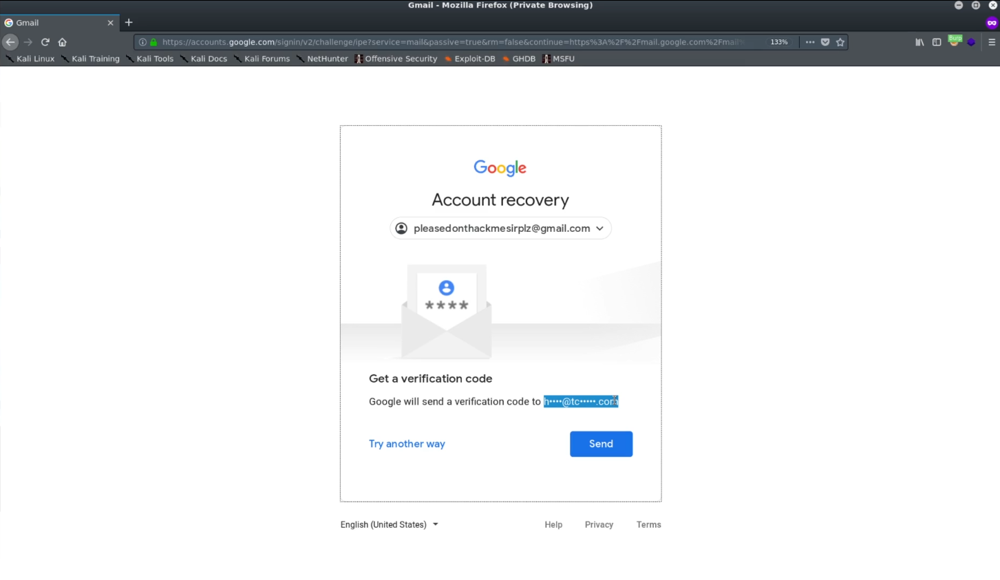

# Reconnaissance

## Passive Reconnaissance Overview
Passive reconnaissance involves gathering information about the target without directly interacting with it, using publicly available data.

### Web/Host

#### Target Validation
These tools are used to validate the identity and details of a target:

- **WHOIS**: Provides domain registration information.
- **nslookup**: Queries DNS to obtain domain name or IP address mapping.
- **dnsrecon**: Performs DNS enumeration and information gathering.

#### Finding Subdomains
These techniques and tools help in identifying subdomains of a target:

- **Google Fu**: Advanced Google search operators to find subdomains.
- **dig**: A command-line tool for querying DNS servers.
- **Nmap**: Can scan for active subdomains.
- **Sublist3r**: Python tool to enumerate subdomains across multiple sources.
- **Bluto**: A tool for finding subdomains and performing OSINT.
- **crt.sh**: Public database for certificate transparency logs.
- **etc...**

#### Fingerprinting
These tools are used to gather information about the technologies and services used by the target:

- **Nmap**: Network scanning tool that can identify operating systems and services.
- **Wappalyzer**: Browser extension that identifies technologies used on websites.
- **Whatweb**: Recognizes and identifies web technologies.
- **BuiltWith**: Web-based service to identify a website’s tech stack.
- **Netcat**: Networking tool for reading from and writing to network connections.

#### Data Breaches
These platforms help check if the target has been involved in any data breaches:

- **HaveIBeenPwnd**: Checks if emails or credentials have been exposed in a breach.
- **Breach-Parse**: A tool for parsing breach data.
- **WeLeakInfo**: Database of leaked information from various breaches.

## Discovering Email Addresses

One of the key steps in reconnaissance is discovering email addresses associated with a target.

### Finding Emails by Company

1. **[Hunter.io](https://hunter.io)**: Hunter.io is a popular tool used to find email addresses by company name.

2. **[Phonebook.cz](https://phonebook.cz)**: Another tool to search for email addresses across various domains and companies.

### Verifying Email Addresses

Once email addresses are gathered, they can be verified for validity using online tools:

3. **[Email Hippo](https://tools.emailhippo.com/)**: A service to verify whether an email address is valid and deliverable.

4. **[Email Checker](https://email-checker.net/)**: Another tool to check the validity of email addresses.

### Using Recovery Methods

Do not underestimate recovery methods (such as account recovery options) to gather additional information related to email addresses.

