# Scanning & Enumeration

---

# Menu

- [Scanning with Nmap](#scanning-with-nmap)
  - [Discover the Target IP using Netdiscover](#step-1-discover-the-target-ip-using-netdiscover)
  - [Perform a Full Nmap Scan](#step-2-perform-a-full-nmap-scan)
- [Enumerating HTTP and HTTPS](#enumerating-http-and-https)
  - [Web Vulnerability Scanning with Nikto](#step-1-web-vulnerability-scanning-with-nikto)
  - [Directory Busting with DirBuster](#step-2-directory-busting-with-dirbuster)
- [Enumerating SMB](#enumerating-smb)
  - [Using Metasploit for SMB Enumeration](#step-1-using-metasploit-for-smb-enumeration)
  - [Using smbclient for SMB Enumeration](#step-2-using-smbclient-for-smb-enumeration)
- [Enumerating SSH](#enumerating-ssh)
  - [Identifying the SSH Port](#step-1-identifying-the-ssh-port)
  - [Attempting SSH Connection](#step-2-attempting-ssh-connection)
  - [Looking for Banners](#step-3-looking-for-banners)
  - [Avoid Brute Force Attacks](#step-4-avoid-brute-force-attacks)
- [Researching Potential Vulnerabilities](#researching-potential-vulnerabilities)
  - [Using searchsploit for Vulnerability Search](#using-searchsploit-for-vulnerability-search)

---

To begin scanning and enumeration, we'll be using **Kioptrix Level 1**, a vulnerable machine that you can download from [this link](https://www.vulnhub.com/entry/kioptrix-level-1-1,22/).

## Scanning with Nmap

Before running an Nmap scan, it’s essential to locate the target machine on the network. In this case, we will use **Netdiscover** to identify the IP address of the Kioptrix machine.

### Step 1: Discover the Target IP using Netdiscover

We use **Netdiscover** to perform an ARP scan on the local network to find the Kioptrix machine. The following command scans the IP range of the local area network (LAN):

```bash
netdiscover -r 192.168.1.0/24
```

Here, the `-r` flag specifies the IP range to scan. For example, `192.168.1.0/24` represents the entire subnet.

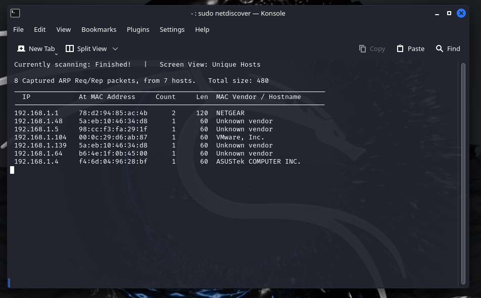

In this example, we identified that the Kioptrix machine has the IP address `192.168.1.104`, as it is the only VMware Inc. device detected on the network.

### Step 2: Perform a Full Nmap Scan

Once we know the target IP, we can run a comprehensive Nmap scan to gather more information about open ports, services, and possible vulnerabilities.

```bash
nmap -T4 -p- -A 192.168.1.104
```

- `-T4` increases the speed of the scan (on a scale of `T0` to `T5`).
- `-p-` tells Nmap to scan all 65,535 ports.
- `-A` enables aggressive mode, providing detailed information, including the operating system, services, and version detection.

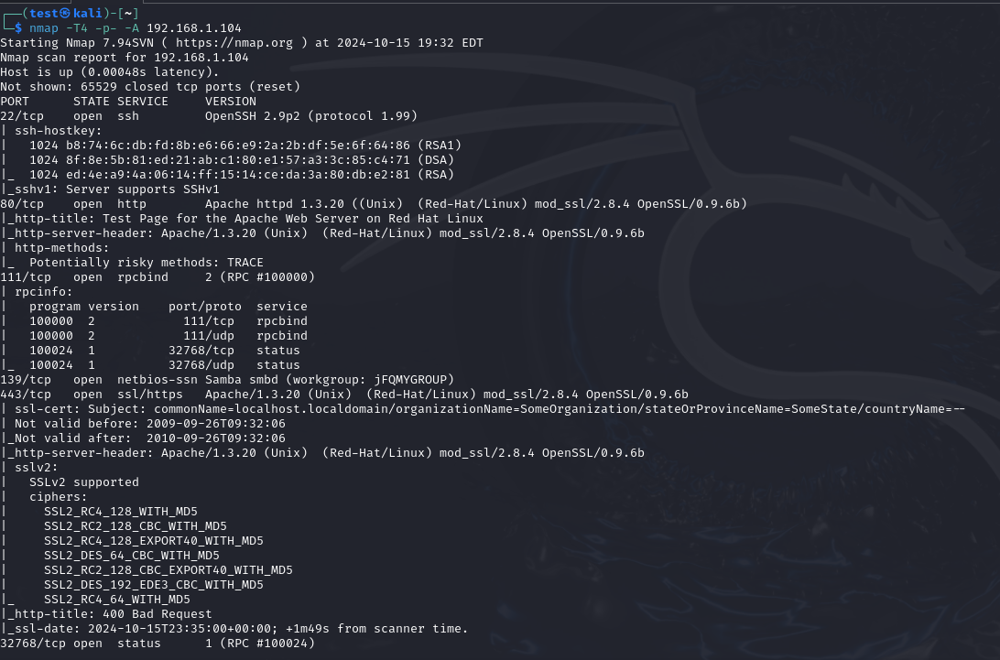

This scan will reveal the open ports, running services, and other essential details about the Kioptrix machine, which will help in further enumeration and exploitation.

## Enumerating HTTP and HTTPS

Once we've identified that HTTP or HTTPS services are running on the target machine (from our Nmap scan), we can start exploring potential vulnerabilities in these services. Below are two common methods for HTTP/HTTPS enumeration: **web vulnerability scanning** and **directory busting**.

### Step 1: Web Vulnerability Scanning with Nikto

Nikto is a web server scanner that detects vulnerabilities like outdated software versions, server misconfigurations, and insecure files.

To scan the Kioptrix machine for web vulnerabilities, use the following command:

```bash
nikto -h http://192.168.1.104
```

This command scans the HTTP service on the target IP `192.168.1.104` (the IP of the Kioptrix machine).

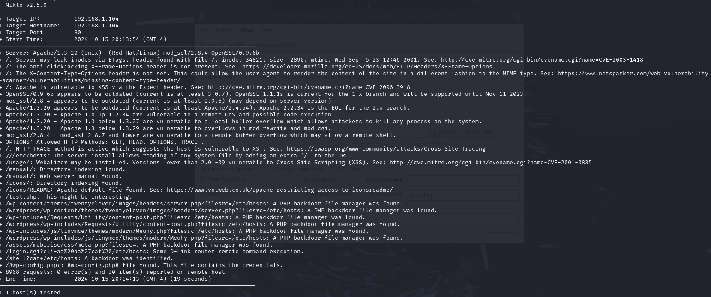

Nikto will provide detailed output about potential vulnerabilities, such as dangerous files, outdated software, or insecure configurations.

### Step 2: Directory Busting with DirBuster

After scanning the web server, it's essential to perform directory busting to discover hidden directories and files that might contain sensitive information or exploitable features. 

Several tools are available for this purpose, such as:
- `dirbuster`
- `gobuster`
- `dirb`

For this, we'll use **DirBuster**, which has a graphical user interface (GUI).

#### How to Run DirBuster:
1. Launch DirBuster in the background with the following command:

    ```bash
    dirbuster &
    ```

2. Set the target URL (e.g., `http://192.168.1.104`) and configure settings such as wordlists and file extensions to brute force directories. 

3. Start the scan and wait for the results to uncover directories, files, or admin panels.

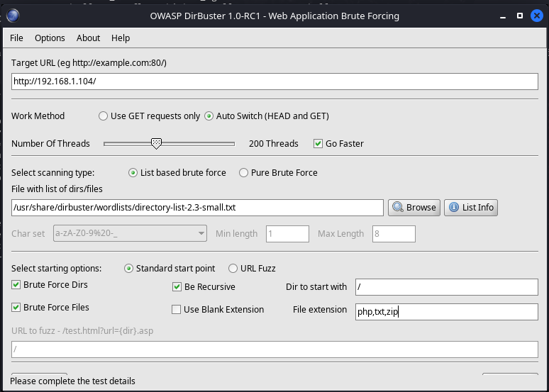

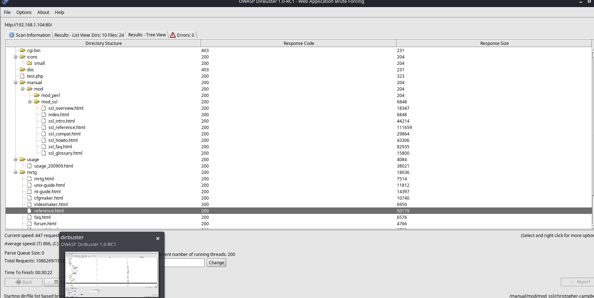

### Understanding the Results

When performing directory busting, it's essential to understand what type of files or directories to look for. Different web servers use different types of file extensions:

- **IIS**: Typically uses `.asp` or `.aspx` files.
- **Apache**: Often uses `.php` or `.html` files.

For the **Kioptrix** machine, pay attention to the type of server found during Nmap and Nikto scanning. The results of these scans and directory busting can lead to paths that may contain sensitive information or vulnerabilities for exploitation.

## Enumerating SMB

To explore potential vulnerabilities in SMB (Server Message Block), we can leverage **Metasploit** as well as tools like **smbclient**. SMB enumeration is crucial because misconfigurations or open shares could expose sensitive data or allow for further exploitation.

### Step 1: Using Metasploit for SMB Enumeration

1. **Launch Metasploit:**
   Start Metasploit by running:
   
   ```bash
   msfconsole
   ```

   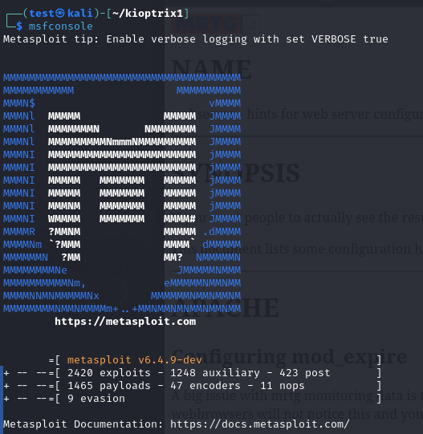

2. **Search for SMB Modules:**
   Use the search function to find SMB-related modules. For instance:

   ```bash
   search smb
   ```

3. **Use SMB Version Scanner:**
   To check the SMB version running on the target machine (IP `192.168.1.104`), you can use the **smb_version** auxiliary module. Select it with:

   ```bash
   use auxiliary/scanner/smb/smb_version
   ```

4. **View Module Options:**
   Use the `info` command to learn more about the module, or use `options` to list the configurable settings. 

   ```bash
   options
   ```

   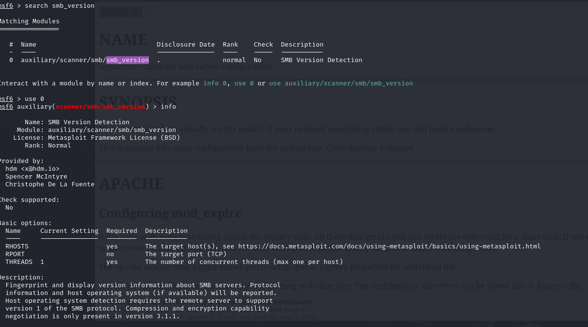

5. **Set Target Options:**
   Set the RHOSTS (target IP) using the following command:

   ```bash
   set RHOSTS 192.168.1.104
   ```

   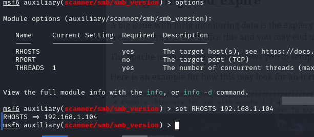

6. **Run the Module:**
   After configuring the options, run the module to enumerate SMB details:

   ```bash
   run
   ```

   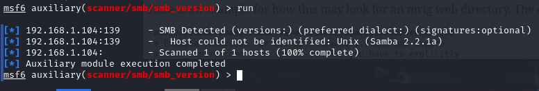

### Step 2: Using `smbclient` for SMB Enumeration

Another way to enumerate SMB shares is by using **smbclient**, a command-line tool for accessing SMB/CIFS resources on a network.

1. **List Available Shares:**
   Use the following command to list the available shares on the target machine (IP `192.168.1.104`):

   ```bash
   smbclient -L \\192.168.1.104
   ```

   This command will display all shared directories and any potentially accessible shares. 

   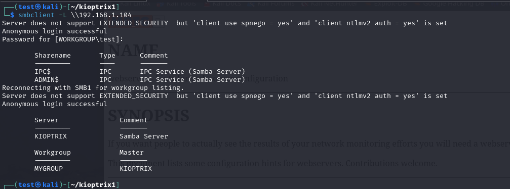

2. **Attempt to Access Anonymous Shares:**
   If anonymous access is allowed on any share, you can connect to it using:

   ```bash
   smbclient ////192.168.1.104//ADMIN$
   ```

   In this case, the anonymous login attempt failed:

   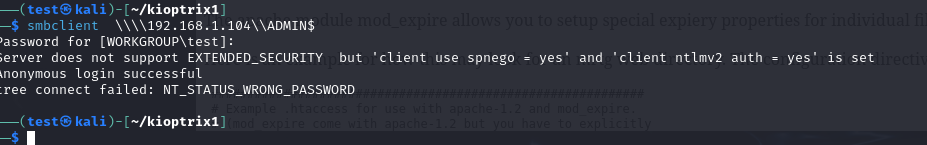

## Enumerating SSH

When enumerating SSH, the process is often limited unless misconfigurations or banners are present that can provide valuable information. SSH services are typically hardened, making enumeration efforts mainly about identifying the service version or potential weak configurations. Here's how to approach it:

### Step 1: Identifying the SSH Port

During the Nmap scan, you should have identified whether SSH is running and on which port (default is 22). In this case, SSH is available on the target machine at `192.168.1.104`.

### Step 2: Attempting SSH Connection

Since this machine is old, it may be using outdated encryption algorithms or cipher suites. To connect to the SSH service, you can specify these weaker algorithms by using the following command:

```bash
ssh 192.168.1.104 -oKexAlgorithms=+diffie-hellman-group1-sha1 -c aes128-cbc
```

This allows you to connect to the server using older key exchange algorithms (`diffie-hellman-group1-sha1`) and a weaker cipher (`aes128-cbc`), which were common in older systems.

### Step 3: Looking for Banners

Sometimes, SSH servers display a banner when you attempt to connect. The banner may reveal the SSH service version, the operating system, or other important details. If a banner is displayed, it could look like:

```
Welcome to Kioptrix!
Ubuntu 12.04.5 LTS
Kernel 3.13.0-117-generic
```

These details could help you understand the underlying OS or software versions, which can be useful for further research or exploitation.

### Step 4: Avoid Brute Force Attacks

Brute-forcing SSH passwords falls under exploitation, not enumeration. You should avoid it at this stage, as it is often detected by intrusion detection systems (IDS) and could lead to account lockouts or alerts.

In this case, the SSH connection attempt did not reveal a banner:

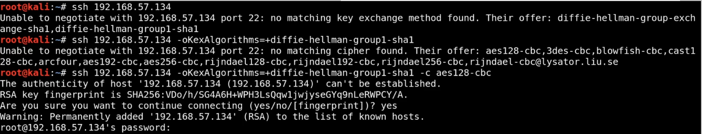

However, in other instances, a banner might provide critical information that could be used in further stages of exploitation.

## Researching Potential Vulnerabilities

Based on the gathered information, here’s a summary of the services and associated vulnerabilities discovered:

**1. HTTP/HTTPS: Apache 1.3.20 & mod_ssl/2.8.4**
- **Apache 1.3.20**: There is a well-known vulnerability associated with directory traversal in this version, which can provide **root directory access**.
  - Exploit link: [Apache 1.3.20 Directory Traversal](https://www.exploit-db.com/exploits/19975)

- **mod_ssl/2.8.4**: Versions 2.8.7 and lower are vulnerable to a **remote buffer overflow** that can potentially provide a remote shell.
  - Exploit link: [mod_ssl Remote Buffer Overflow](https://www.exploit-db.com/exploits/764)
  - GitHub link: [OpenLuck Exploit](https://github.com/heltonWernik/OpenLuck)

**2. Samba (SMB): Version 2.2.1a**
- Samba 2.2.1a is vulnerable to **remote buffer overflow**, which can lead to remote code execution (RCE). Exploiting this could provide access to the system remotely through Samba shares.
  - Exploit link: [Samba 2.2.1a Exploit (Trans2open)](https://www.exploit-db.com/exploits/22468)
  - Metasploit module: [Samba Trans2open](https://www.rapid7.com/db/modules/exploit/linux/samba/trans2open)
  - Remote Buffer Overflow: [Samba 2.2.1a Buffer Overflow](https://www.exploit-db.com/exploits/10)

**3. Webalizer: Version 2.01**
- **Webalizer 2.01**: Vulnerable to **Cross-Site Scripting (XSS)** attacks. XSS attacks can be leveraged to steal cookies, session tokens, or perform other malicious actions.
  - CVE link: [CVE-2001-0835](https://cve.mitre.org/cgi-bin/cvename.cgi?name=CVE-2001-0835)

**4. SSH: OpenSSH 2.9.p2**
- **OpenSSH 2.9.p2**: Vulnerable to **username enumeration**, which could be used to identify valid usernames on the system. This information can aid brute-force or further attacks.
  - Exploit link: [OpenSSH 2.9.p2 Username Enumeration](https://www.exploit-db.com/exploits/695)

### **Using `searchsploit` for Vulnerability Search**
Instead of manually browsing through the web for vulnerabilities, you can use the `searchsploit` tool to search for exploits available in the **Exploit-DB** database directly from the terminal. Below is a demonstration:

- **Searching for Samba 2.2.1a**:
  ```bash
  searchsploit Samba 2.2.1a
  ```

  Alternatively, searching for a broader range of versions:
  ```bash
  searchsploit Samba 2
  ```

- **Search results**:
  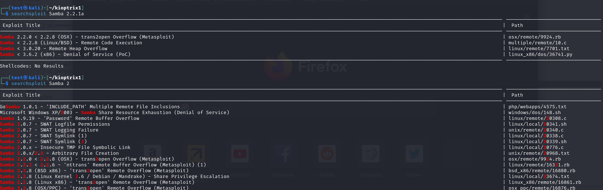

- **For OpenSSH 2.9.p2**, we found an exploit for username enumeration:
  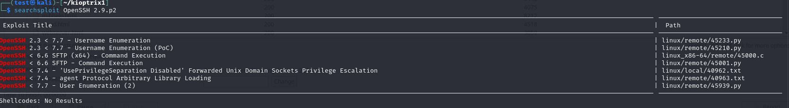

