# Exploitation Basics

## Menu

## Reverse Shells vs Bind Shells

### Reverse Shell
In a reverse shell, the **target system** initiates the connection to the **attacker's machine**. This is typically used to bypass firewall restrictions or network configurations that would prevent inbound connections from being established directly.

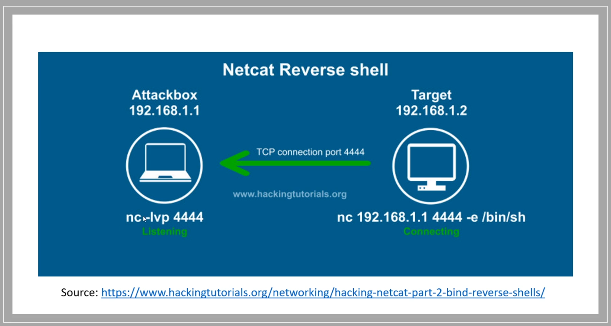

### Bind Shell
In a bind shell, the **target system** listens on a specific port for an incoming connection, allowing the **attacker** to connect directly to it. This type of shell can be restricted by firewall rules or network configurations that block external access to certain ports.

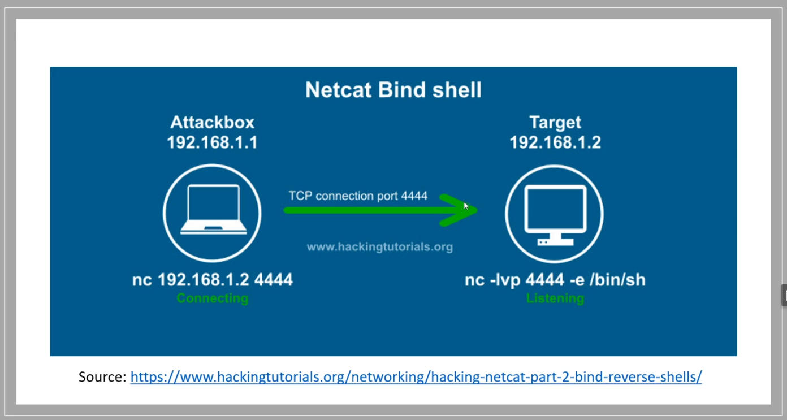

## Staged vs Non-Staged Payloads

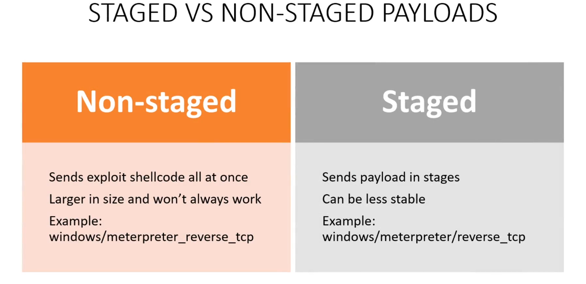

## Gaining Root Access with Metasploit

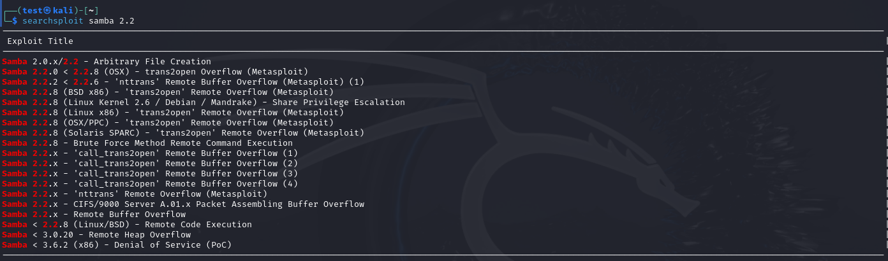

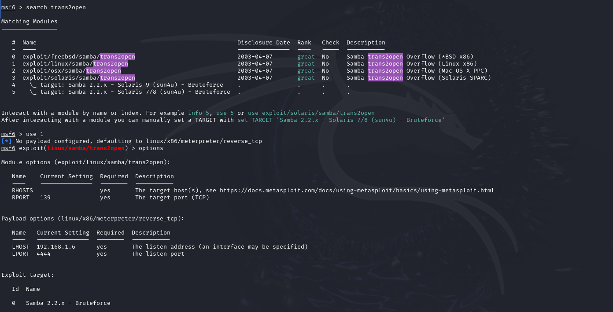

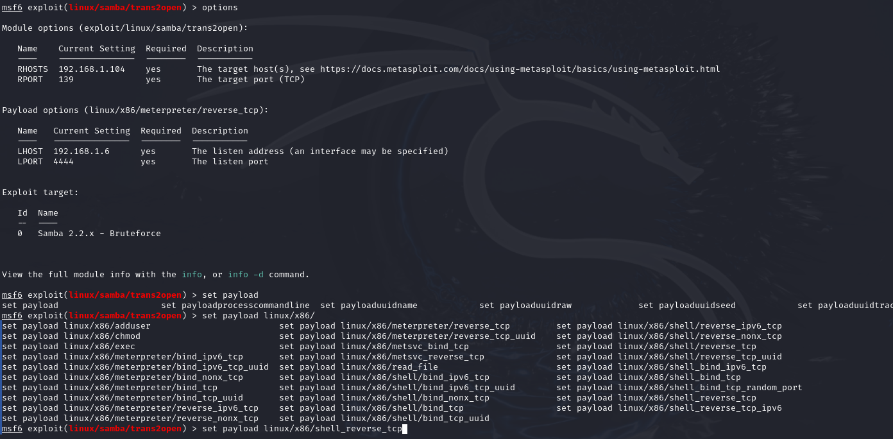

## Manual Exploitation

Using https://github.com/exploit-inters/OpenFuck

We can get a shell for root user 

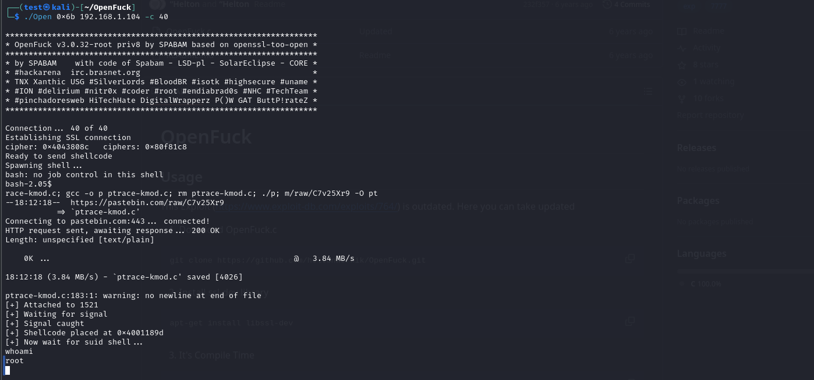

## Brute Force Attacks

One common tool for performing brute force attacks is `hydra`, a versatile and powerful password-cracking tool that supports numerous protocols and services.

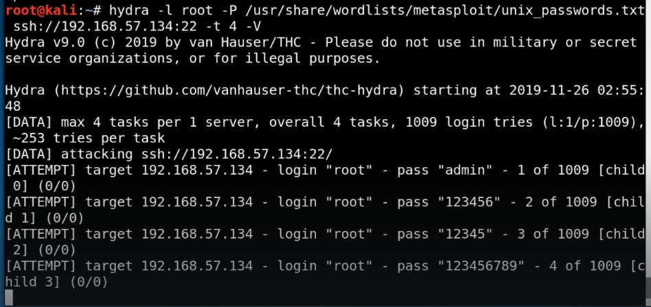

### Another Approach: Metasploit
Metasploit can also be used to perform brute force attacks by utilizing different auxiliary modules designed for cracking passwords of various services.

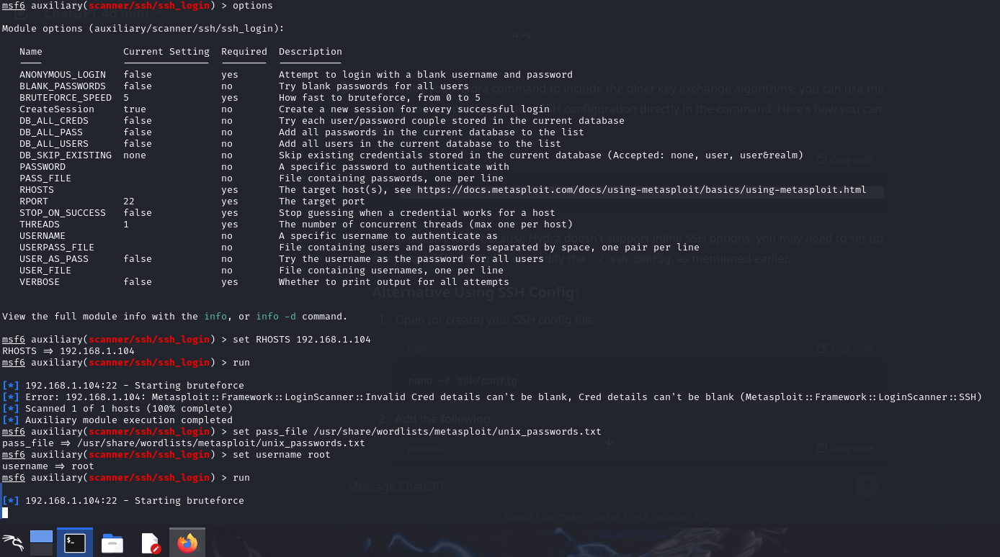

## Credentials Stuffing and Password Spraying

### Credentials Stuffing
Credential stuffing involves using already breached username-password pairs and attempting to log in to different websites or services. Attackers leverage tools like **Burp Suite's Intruder** to automate this process and try the stolen credentials on various platforms.

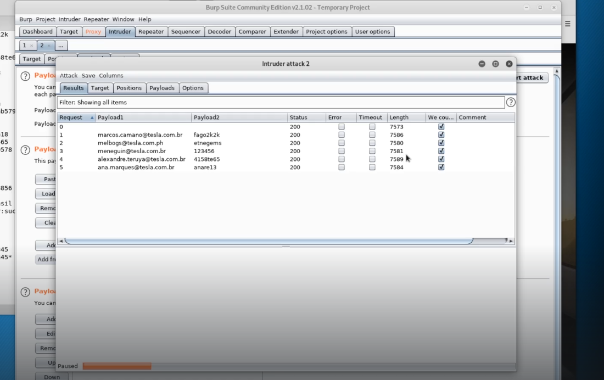

### Password Spraying
Password spraying is a similar attack where the attacker attempts a single or few common passwords (e.g., "password123", "Welcome2024") across multiple accounts on a service, avoiding account lockouts that might occur after multiple failed login attempts for the same user.

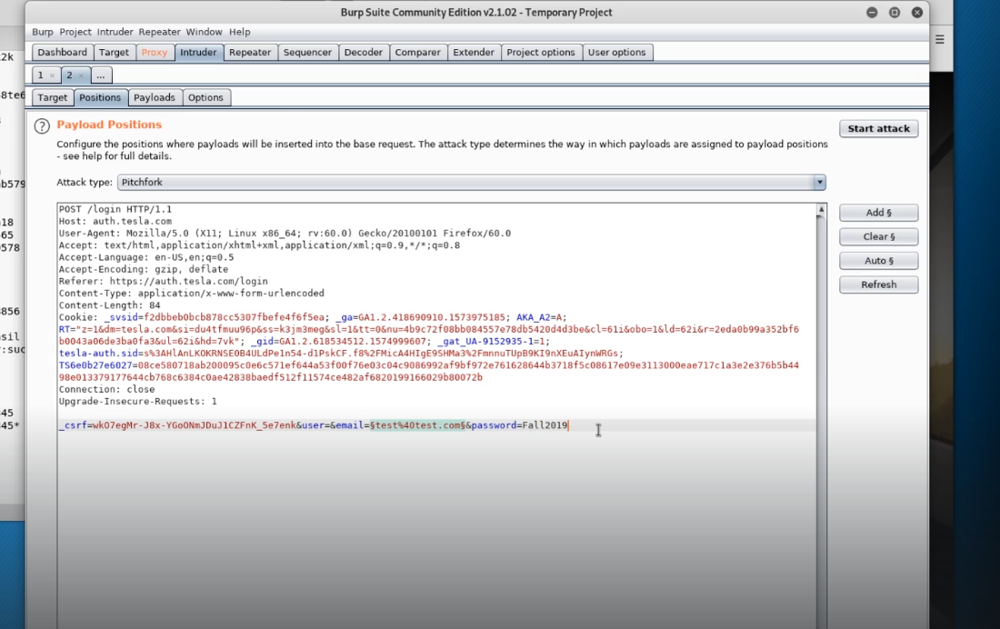
