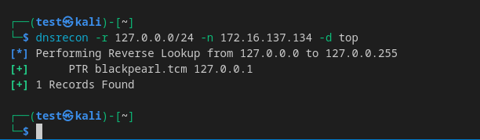
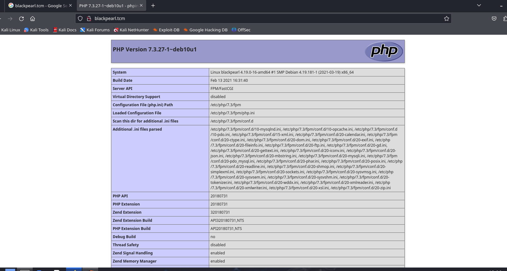
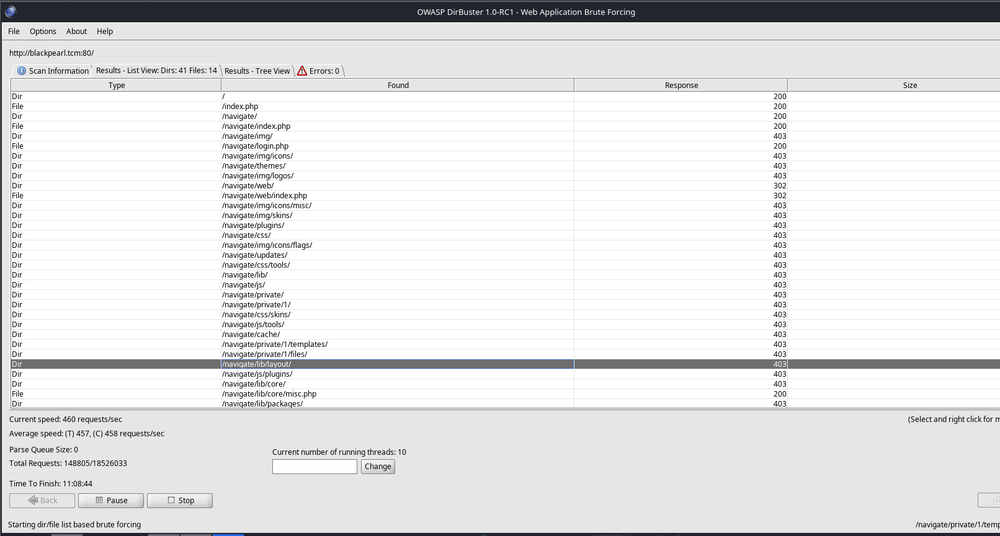
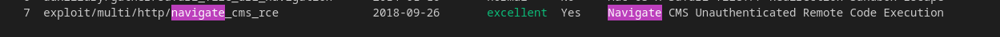
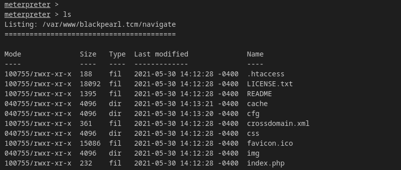
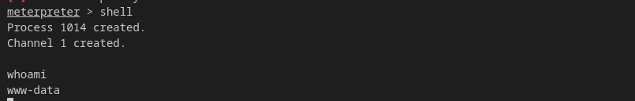
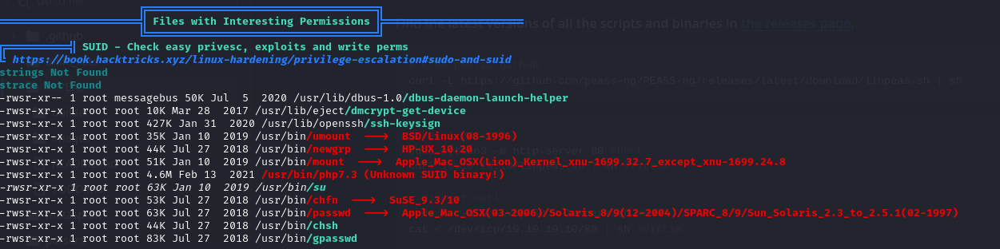
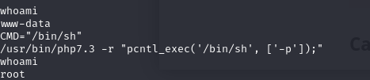

## Nginx Version and Web Discovery

- **Nginx Version**: We identified that the Nginx server is running version `1.14.2`.
- **Webmaster Contact**: The email `alek@blackpearl.tcm` was found in the source code of the default webpage.

### DNS Reconnaissance

Using `dnsrecon` to enumerate the DNS records:

```bash
dnsrecon -r 127.0.0.0/24 -n 172.16.137.134 -d top
```



We discovered a DNS record for `blackpearl.tcm`.

### PHP Info Page

Accessing the webpage through the domain name reveals a `phpinfo()` page:



### Directory Bruteforcing

We performed a second round of directory brute-forcing to discover additional resources:



This led to the discovery of a **Navigate folder** (`navigatecsm`).

### Exploitation - Remote Code Execution (RCE)

Upon searching in Metasploit, we found an **RCE exploit** for the discovered service:



Running the exploit successfully yielded **Remote Code Execution** (RCE):



### Gaining Initial Access

After gaining a shell, we confirmed that we are running as the `www-data` user:

```bash
whoami
```



### Privilege Escalation

To escalate privileges, we used `linpeas` to scan the system. We found that **PHP 7.3** has the **SUID** bit set, which might be exploitable:



Using **GTFOBins**, we found a privilege escalation method for **PHP SUID**: [GTFOBins PHP SUID Escalation](https://gtfobins.github.io/gtfobins/php/)



### Root Access

By exploiting the SUID bit on PHP, we successfully escalated our privileges and rooted the box.
