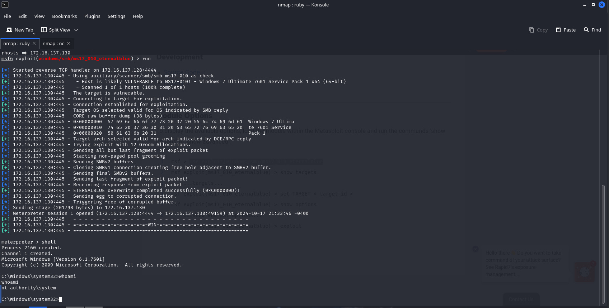

## Download VM

[Download the VM](https://drive.usercontent.google.com/download?id=1A7bDqIOLzFjVBbVEa_sqOj7ExOT-hY0E&export=download&authuser=0&confirm=t&uuid=bde4a57d-4ac4-418c-ace0-78237fa234cd&at=AN_67v1AhCY8BWu3TlfTczCupKBd:1729208831574)

---

## Scan Results

Upon conducting an initial **Nmap** scan, the following open ports were identified, indicating potential attack vectors:

Command : ```nmap -T4 -p- 172.16.137.130```

```bash
PORT      STATE SERVICE      VERSION
135/tcp   open  msrpc        Microsoft Windows RPC
139/tcp   open  netbios-ssn  Microsoft Windows netbios-ssn
445/tcp   open  microsoft-ds Windows 7 Ultimate 7601 Service Pack 1 microsoft-ds (workgroup: WORKGROUP)
49152/tcp open  msrpc        Microsoft Windows RPC
49153/tcp open  msrpc        Microsoft Windows RPC
49154/tcp open  msrpc        Microsoft Windows RPC
49155/tcp open  msrpc        Microsoft Windows RPC
49156/tcp open  msrpc        Microsoft Windows RPC
```

### Version Identification

To gather additional information about the target, I reran the **Nmap** scan with the `-A` option to enable version detection. The scan results confirmed that the SMB service is running on port 445 with the following details:

Command : ```nmap -T4 -p 445 -A 172.16.137.130```

```bash
445/tcp   open  microsoft-ds Windows 7 Ultimate 7601 Service Pack 1 microsoft-ds (workgroup: WORKGROUP)
```

### Exploit Research

With the version information in hand, I conducted a search for known exploits targeting this specific version. I discovered a relevant exploit for the **EternalBlue** vulnerability, documented on Rapid7's website:

[MS17-010 EternalBlue Exploit](https://www.rapid7.com/db/modules/exploit/windows/smb/ms17_010_eternalblue/)

### Exploitation

I proceeded to utilize the exploit modules in **Metasploit Framework (msfconsole)** to target the identified vulnerability.



As indicated in the session output, I was able to gain the highest privileges, confirming that the target system has been successfully compromised.

There is also the option to do it manually [GitHub Link](https://github.com/3ndG4me/AutoBlue-MS17-010)
