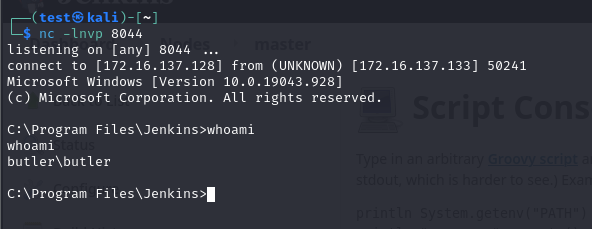
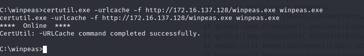
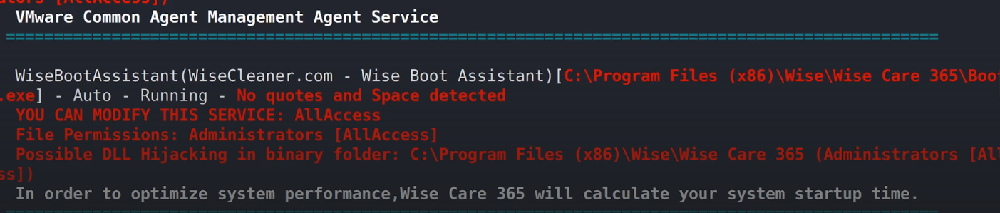
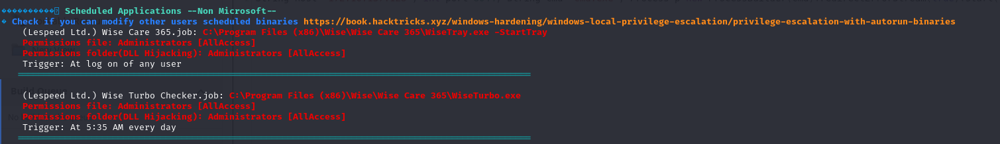
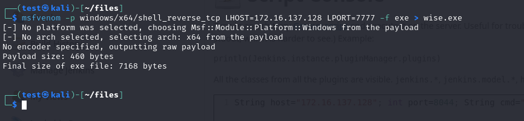
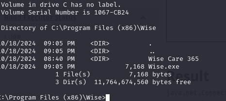
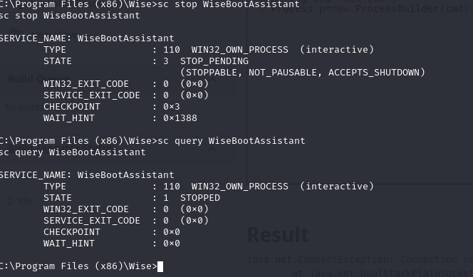
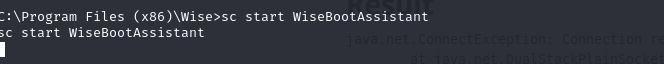
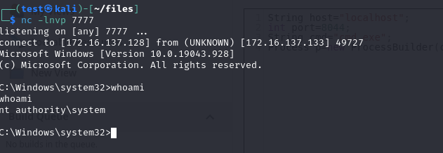

# Butler

## Brute Forcing the Jenkins Webpage

Using Burp Suite, we performed a brute force attack on the Jenkins webpage and successfully found the credentials: 

## Script Console Access

Upon exploration, we discovered access to the script console for the master node. By executing the exploit from [this Gist](https://gist.github.com/frohoff/fed1ffaab9b9beeb1c76), we were able to obtain a reverse shell.

## Privilege Escalation (PrivEsc) Steps

### Downloading winpeas.exe

Next, we downloaded `winpeas.exe` to our attacker machine. We used `certutil.exe` for the download process.

### Process Inspection

Running `winpeas.exe` revealed a running process associated with a task containing spaces. By replacing the original file with an `.exe` file, it can be executed before the scheduled task.

### Crafting a Reverse Shell

We created a crafted reverse shell using `msfvenom`.

### Downloading the Crafted Shell

Again, we utilized `certutil` to download the crafted shell onto the target machine.

### Stopping the Service

At this stage, we needed to stop the relevant service.

### Starting the Service

After restarting the service, we successfully established a shell with `NT AUTHORITY\SYSTEM` privileges.

