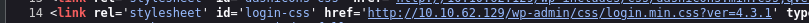
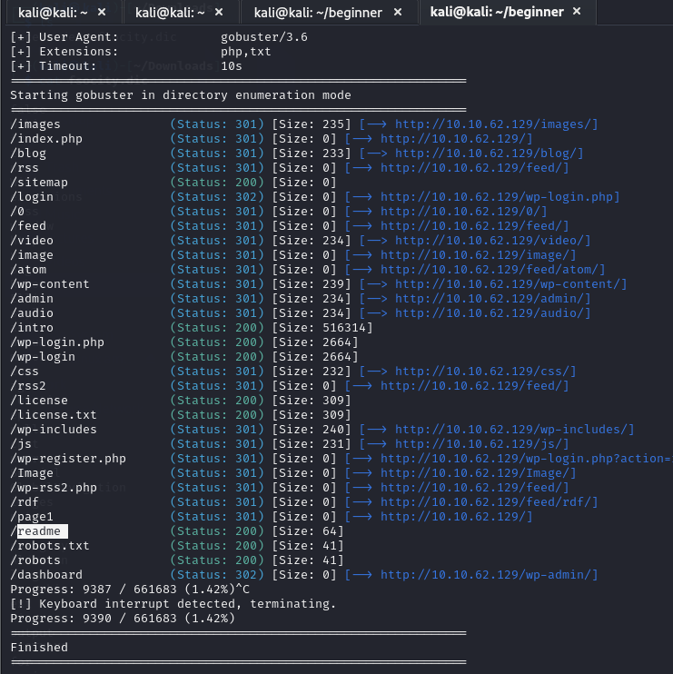
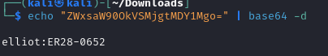
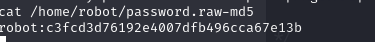
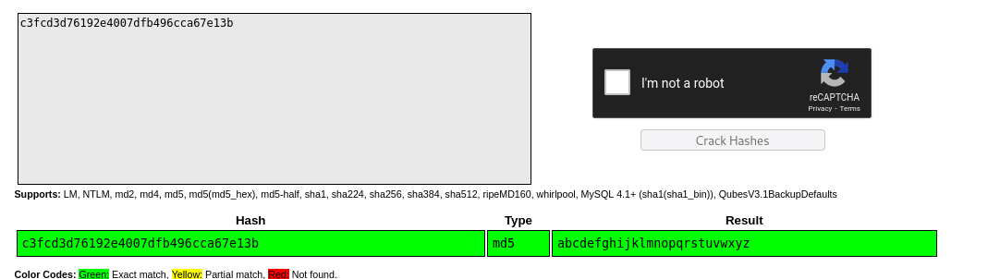
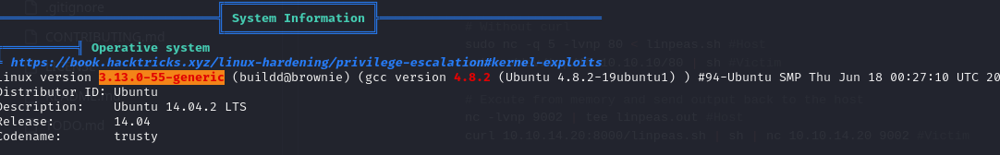
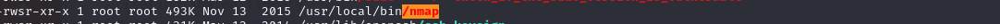
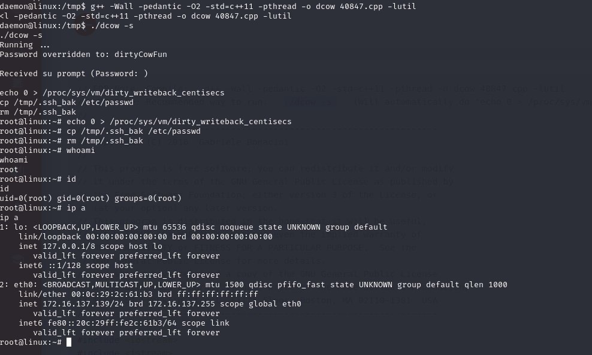
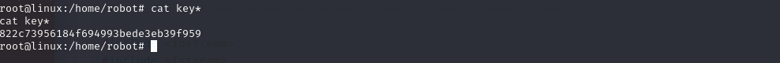

# Mr. Robot CTF Machine Walkthrough

Link : https://tryhackme.com/r/room/mrrobot
Link : https://www.vulnhub.com/entry/mr-robot-1,151/

## 1. Nmap Scan

We begin by scanning the target machine with Nmap to identify open ports and services.

```bash
└─$ nmap -T4 -p- -A 10.10.62.129
```

### Nmap Output
```
Starting Nmap 7.94SVN (https://nmap.org) at 2024-10-20 13:35 EDT
Nmap scan report for 10.10.62.129
Host is up (0.21s latency).
Not shown: 65532 filtered tcp ports (no-response)
PORT    STATE  SERVICE  VERSION
22/tcp  closed ssh
80/tcp  open   http     Apache httpd
|_http-title: Site doesn't have a title (text/html).
|_http-server-header: Apache
443/tcp open   ssl/http Apache httpd
|_http-title: Site doesn't have a title (text/html).
| ssl-cert: Subject: commonName=www.example.com
| Not valid before: 2015-09-16T10:45:03
|_Not valid after:  2025-09-13T10:45:03
|_http-server-header: Apache

Service detection performed. Please report any incorrect results at https://nmap.org/submit/.
Nmap done: 1 IP address (1 host up) scanned in 234.35 seconds
```

### Analysis
- Ports **80** (HTTP) and **443** (HTTPS) are open, indicating a web service is running.
- The SSL certificate is valid from 2015 to 2025, which suggests it’s still in use.

---

## 2. Inspecting the Web Application

While waiting for the Dirbuster scan to complete, I examined the source code of the `wp-login.php` page to identify the WordPress version.

### Version Discovery

- **Version:** 4.3.1

### Vulnerability Search
Found an exploit for this version: [Exploit DB - RCE for WordPress 4.3.1](https://www.exploit-db.com/exploits/50255). However, this exploit requires authentication.

---

## 3. Gathering Information

### Discovering Useful Files
I found a potentially useful `.txt` file via the site's robots.txt file:

```plaintext
User-agent: *
fsocity.dic
key-1-of-3.txt
```
- **Key 1 of 3:** `073403c8a58a1f80d943455fb30724b9`

### Exploring the `robots.txt` File
The robots.txt file contained the path to a downloadable file:


This file may serve as a password dictionary.

---

## 4. Brute Forcing the Login

With the dictionary file `fsocity.dic`, I considered brute-forcing the login. The potential username derived from the files is `fsocity`.

### Brute Force Attempt
Utilized `wpscan` to brute force usernames:
```bash
wpscan --url http://test.local/ --passwords fsocity.dic
```
- **Result:** No valid credentials found, but I learned I could use Metasploit for brute-forcing.

### Unique Passwords Optimization
I noticed many repeated words in the dictionary, so I filtered for unique entries before rerunning the brute force.

### Base64 Decoding
While examining the `/license` page, I found a Base64 encoded string, which decoded to the following credentials:
```bash
elliot:ER28-0652
```


---

## 5. Exploiting Vulnerabilities

Having successfully logged in, I confirmed the WordPress version is still 4.3.1.

### Plugin Exploit
I downloaded and activated a vulnerable plugin: [Exploit DB - Vulnerable Plugin](https://www.exploit-db.com/exploits/36374).

### Gaining Shell Access
Following the guide from [Hacking Articles - WordPress Reverse Shell](https://www.hackingarticles.in/wordpress-reverse-shell/), I obtained a Meterpreter shell as the `daemon` user.

### User Discovery
Listing the `/home` directory, I discovered a user named `robot`.



---

## 6. Privilege Escalation

### User Password Discovery
Inside the `/home/robot/password.raw-m5` user’s file, I found a password:


### Kernel Exploit Suggestion
Running `linpeas`, I noticed highlighted information indicating potential kernel exploits.


### SUID on Nmap
I also discovered that `nmap` has the SUID bit set, which could aid in privilege escalation.


---

## 7. Successful Root Access

Before executing any exploits, I used `linux-exploit-suggester.sh` to confirm vulnerabilities. I found that the machine might be susceptible to this kernel exploit: [Exploit DB - Kernel Exploit](https://www.exploit-db.com/exploits/40847).

### Exploit Execution
The exploit was successful, granting root access to the machine:


### Flag Retrieval
To retrieve the flags, I executed the following commands to locate the remaining keys:
```bash
find / -name key-2-of-3.txt 2> /dev/null
find / -name key-3-of-3.txt 2> /dev/null
```


- **key-1-of-3.txt**: 073403c8a58a1f80d943455fb30724b9
- **key-2-of-3.txt**: 822c73956184f694993bede3eb39f959
- **key-3-of-3.txt**: 04787ddef27c3dee1ee161b21670b4e4

---

## Conclusion

After rooting the machine, I discovered that accessing the `robot` user directly with `su robot` could have expedited the process, leveraging the SUID nmap for privilege escalation.
