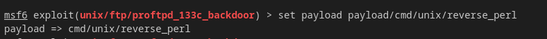
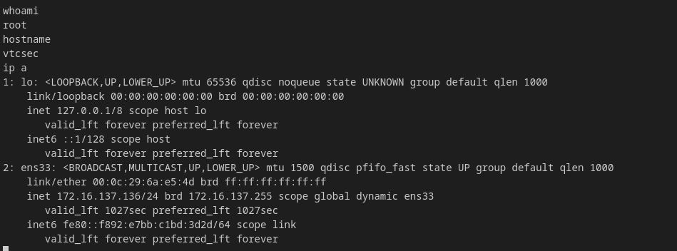

# Basic Pentesting 1 Walkthrough

## Introduction
In this walkthrough, we explore the steps taken to root the **Basic Pentesting 1** virtual machine hosted on VulnHub. The goal is to identify vulnerabilities and gain root access using various enumeration and exploitation techniques.

## Network Scanning and Enumeration

### Nmap Scan
We begin with an **Nmap** scan to identify open ports and services on the target machine:

```bash
Starting Nmap 7.94SVN ( https://nmap.org ) at 2024-10-19 17:01 EDT
Nmap scan report for 172.16.137.136
Host is up (0.00027s latency).
Not shown: 65532 closed tcp ports (reset)
PORT   STATE SERVICE VERSION
21/tcp open  ftp     ProFTPD 1.3.3c
22/tcp open  ssh     OpenSSH 7.2p2 Ubuntu 4ubuntu2.2 (Ubuntu Linux; protocol 2.0)
80/tcp open  http    Apache httpd 2.4.18 ((Ubuntu))
MAC Address: 00:0C:29:6A:E5:4D (VMware)
```

**Key Findings:**
- **FTP (Port 21)**: ProFTPD 1.3.3c
- **SSH (Port 22)**: OpenSSH 7.2p2 (Ubuntu)
- **HTTP (Port 80)**: Apache 2.4.18 (Ubuntu)

Additional service and OS details suggest the machine is running **Linux Kernel 3.X or 4.X**. The **Apache HTTP server** appears to be outdated.

### Nikto Scan
Next, we perform a **Nikto** scan to identify potential vulnerabilities on the web server:

```bash
- Nikto v2.5.0
---------------------------------------------------------------------------
+ Target IP:          172.16.137.136
+ Target Hostname:    172.16.137.136
+ Target Port:        80
+ Server: Apache/2.4.18 (Ubuntu)
+ /: The anti-clickjacking X-Frame-Options header is not present.
+ /: The X-Content-Type-Options header is not set.
+ /: Server may leak inodes via ETags. See: CVE-2003-1418
+ Apache/2.4.18 appears to be outdated.
+ Allowed HTTP Methods: POST, OPTIONS, GET, HEAD
+ /secret/: Drupal Link header found.
+ /icons/README: Apache default file found.
+ 8102 requests: 0 error(s) and 8 item(s) reported.
```

**Notable Results:**
- Missing security headers (X-Frame-Options, X-Content-Type-Options)
- Outdated **Apache version** (2.4.18)
- **/secret/** directory found, possibly linked to Drupal

## Vulnerability Exploration

Before investigating the `/secret/` directory further, I researched whether there were any known vulnerabilities associated with **ProFTPD 1.3.3c**. I discovered that this version is vulnerable to a **backdoor exploit**:

### ProFTPD 1.3.3c Backdoor Exploit
The **ProFTPD 1.3.3c** version has a known backdoor vulnerability that allows remote attackers to execute arbitrary code. This vulnerability is documented [here](https://www.rapid7.com/db/modules/exploit/unix/ftp/proftpd_133c_backdoor).

To exploit the backdoor, we set up the appropriate payload and executed the exploit:



## Gaining Root Access
The exploit successfully provided root access to the target machine:



## Conclusion
By identifying open services, outdated software, and leveraging known vulnerabilities such as the **ProFTPD 1.3.3c backdoor**, we successfully rooted the **Basic Pentesting 1** virtual machine. This walkthrough highlights the importance of patching software to prevent exploitation through known vulnerabilities.
