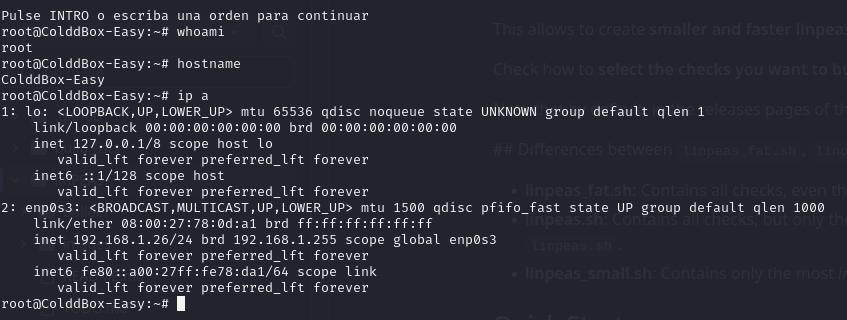

Link: https://www.vulnhub.com/entry/colddbox-easy,586/

## 1. Initial Website Scan using Nmap

The target was scanned using `nmap` to identify open ports and services running on the server.

```bash
Starting Nmap 7.94SVN ( https://nmap.org ) at 2024-10-21 20:48 EDT
Stats: 0:00:01 elapsed; 0 hosts completed (0 up), 1 undergoing Ping Scan
Parallel DNS resolution of 1 host. Timing: About 0.00% done
Nmap scan report for 192.168.1.26
Host is up (0.00071s latency).
Not shown: 65533 closed tcp ports (conn-refused)
PORT     STATE SERVICE VERSION
80/tcp   open  http    Apache httpd 2.4.18 ((Ubuntu))
|_http-title: ColddBox | One more machine
|_http-generator: WordPress 4.1.31
|_http-server-header: Apache/2.4.18 (Ubuntu)
4512/tcp open  ssh     OpenSSH 7.2p2 Ubuntu 4ubuntu2.10 (Ubuntu Linux; protocol 2.0)
| ssh-hostkey: 
|   2048 4e:bf:98:c0:9b:c5:36:80:8c:96:e8:96:95:65:97:3b (RSA)
|   256 88:17:f1:a8:44:f7:f8:06:2f:d3:4f:73:32:98:c7:c5 (ECDSA)
|_  256 f2:fc:6c:75:08:20:b1:b2:51:2d:94:d6:94:d7:51:4f (ED25519)
Service Info: OS: Linux; CPE: cpe:/o:linux:linux_kernel

Service detection performed. Please report any incorrect results at https://nmap.org/submit/ .
Nmap done: 1 IP address (1 host up) scanned in 21.78 seconds
```

From the scan results:
- **Port 80 (HTTP)** is open, running Apache HTTP Server 2.4.18, and the website is powered by **WordPress 4.1.31**.
- **Port 4512 (SSH)** is open, running OpenSSH 7.2p2 on Ubuntu.

The website appears to be a WordPress installation named **ColddBox**.

---

## 2. Directory Bruteforce using Dirb

I used `dirb` to scan for hidden directories and files on the website. Here's the result:


Among the findings, there was a potential username revealed: `C0ldd`.


---

## 3. Username Enumeration using WPScan

Next, I used `wpscan` to enumerate the users on the WordPress site.

```bash
wpscan --url http://192.168.1.26 --enumerate u
```

It discovered the following users:


The users found are:
- **the cold in person**
- **hugo**
- **philip**
- **c0ldd**

---

## 4. Brute-Forcing Passwords

I attempted to brute-force the passwords for the enumerated users using the `rockyou.txt` wordlist.

```bash
wpscan --url http://192.168.1.26 -U user.txt -P /usr/share/wordlists/rockyou.txt
```

So far, I found one valid password for user **c0ldd**:

```bash
c0ldd:9876543210
```


---

## 5. Administrator Access

Upon logging in with the credentials `c0ldd:9876543210`, I gained administrator access to the WordPress dashboard.


At this point, I stopped further brute-forcing attempts as admin privileges were obtained.

---

## 6. Reverse Shell via Vulnerable Plugin

Next, I uploaded a vulnerable WordPress plugin to gain a reverse shell on the server. The exploit used can be found here: [Exploit-DB 36374](https://www.exploit-db.com/exploits/36374).

Once activated, I successfully obtained a reverse shell.


---

## 7. Privilege Escalation via Linpeas

I executed the `linpeas.sh` script to search for privilege escalation paths. It revealed a database configuration file containing the credentials `c0ldd:cybersecurity`.

I used these credentials to log in via SSH, which was successful.


---

## 8. Decoding the User Flag

I found the user flag in `user.txt`, which was encoded in base64.

```bash
RmVsaWNpZGFkZXMsIHByaW1lciBuaXZlbCBjb25zZWd1aWRvIQ==
```

Decoded, it reads:

```bash
Felicidades, primer nivel conseguido!
```


---

## 9. Sudo Privileges and Root Access

Running `sudo -l` revealed that I had the ability to run several commands with sudo privileges. Using `vim`, I escalated my privileges to root.


Using the following steps in `vim`, I achieved privilege escalation:




---

## 10. Obtaining the Root Flag


Finally, as root, I retrieved the root flag. It was also base64 encoded:

```bash
wqFGZWxpY2lkYWRlcywgbcOhcXVpbmEgY29tcGxldGFkYSE=
```

Decoded, it reads:

```bash
¡Felicidades, máquina completada!
```


