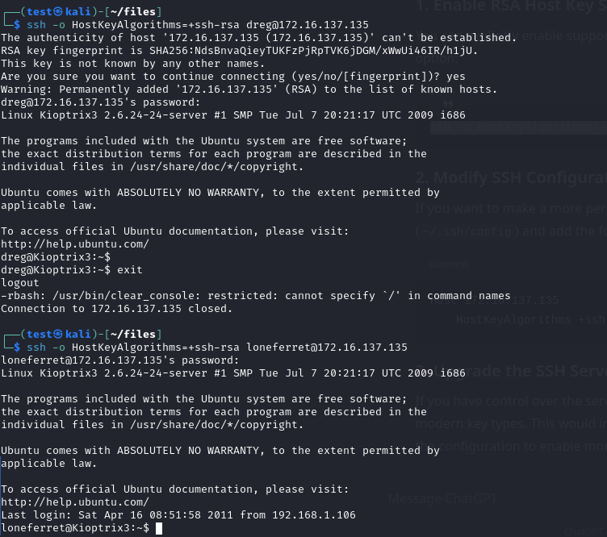

# Kioptrix Level 3 Walkthrough

## Introduction
In this walkthrough, we explore the Kioptrix Level 3 virtual machine hosted on VulnHub. The objective is to identify vulnerabilities and gain root access.

## Initial Reconnaissance
Upon scanning the target, we discovered the following open ports:
- **Port 22** (SSH)
- **Port 80** (HTTP)

### Website Information
The homepage of the website revealed critical information:


**Server Details**:
- **Apache Version**: `Apache/2.2.8 (Ubuntu)`
- **PHP Version**: `PHP/5.2.4-2ubuntu5.6 with Suhosin-Patch`
- **Host**: `kioptrix3.com` (Port 80)

Additionally, we noticed that the site is powered by **LotusCMS**:


## Directory Enumeration
Using **ffuf**, we identified multiple interesting directories that warrant further investigation:


### Nikto Scan Results
Conducting a **Nikto** scan provided additional insights:


### User Enumeration
A possible username discovered during the reconnaissance phase was:
- **loneferret**


## Exploitation
After confirming that the site is powered by **LotusCMS**, a quick Google search led us to an exploit we could leverage: [LotusCMS Remote Code Execution](https://github.com/Hood3dRob1n/LotusCMS-Exploit/blob/master/lotusRCE.sh?source=post_page-----1efb94ccf630--------------------------------).

Executing the exploit successfully provided us access to the target machine:


We gained a reverse shell as the user `www-data`. The next step was privilege escalation.

## Privilege Escalation
Running **linpeas** allowed us to identify potential privilege escalation paths. We discovered two users:
- **loneferret**
- **dreg**


### Sensitive Information
We located a file containing the MySQL root password:


**Root Password**: `root:fuckeyou`

With access to the MySQL database, specifically the **gallery**, we executed queries to enumerate `dev_accounts`:


### Hash Identification
Using **hash-identifier**, we identified the password hash type as **MD5**. We utilized an online MD5 cracker to retrieve the passwords:


### Credentials Found
We obtained the following credentials for the development accounts:
```plaintext
dreg:Mast3r
loneferret:starwars
```

## Gaining SSH Access
Both user accounts worked for SSH login:


Upon logging in, we ran `sudo -l`, which indicated that we could execute `ht` as sudo:


This access allowed us to modify the `/etc/sudoers` file, granting us the ability to execute `/bin/bash`:


## Root Access Achieved
With the above modifications, we successfully gained root access to the machine:


## Conclusion
We have successfully rooted the Kioptrix Level 3 virtual machine, demonstrating the effectiveness of the identified vulnerabilities and exploitation techniques.
